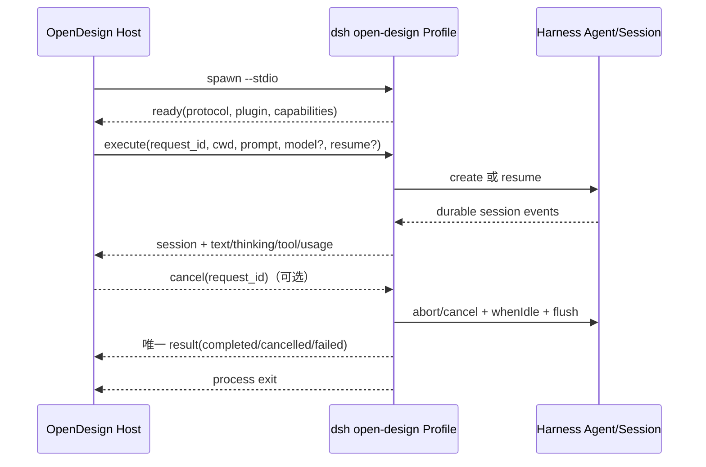
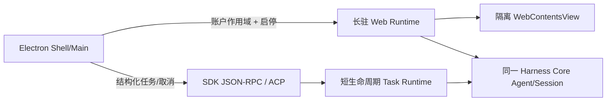

# OpenDesign `dsh-runtime` 与因赛AI客户端 Runtime 对照分析

> 分析日期：2026-09-09  
> 面向对象：客户端、Runtime 与 Harness Core 架构/研发人员  
> 结论性质：源码与仓库现状分析，不是实施方案或版本承诺

## 1. 执行结论

`@open-design/dsh-runtime` 值得借鉴，但不适合整体引入，也不应被当作我们现有 Runtime 的替代品。

最关键的判断是：两边名为“runtime”的对象不在同一层。

- OpenDesign 的 `dsh-runtime` 是一个很薄的 **Host Adapter / Profile Companion**：把用户已安装的 DeepSeek Harness 包成 OpenDesign 自己能驱动的、一次一进程的 JSONL Agent Runtime。
- 因赛AI客户端的 Runtime 是一套 **受控发行物 + Electron 子进程宿主 + 账户隔离 Profile + 长驻 Web 工作区**。它负责的不只是一次 Agent 执行，还包括版本锁定、进程隔离、插件组合、恢复、WebContentsView 生命周期与用户数据边界。

因此，OpenDesign 最有价值的不是 Agent 内核——它的 Agent、Session、Model Selection、持久化本来就来自 DeepSeek Harness——而是以下四种边界工程：

1. **可验证的运行时握手**：`probe → ready → session → result`，能力与协议版本显式返回。
2. **结构化、相关联的运行结果**：所有帧带 `request_id`，且一条执行必须以唯一终态收口。
3. **取消与退出竞态处理**：取消可早于 Agent 创建到达，并在真正激活后重放；退出有停稳边界和有界兜底。
4. **内容寻址的 Companion 安装**：随应用携带精确 tgz 与 SHA-256，安装后再次 probe，而不是信任命令退出码。

对我们的建议不是再造一套 OpenDesign JSONL，而是：

- **P0：给 Shell ↔ Core 增加“活体 Runtime 身份/能力握手”和结构化启动失败。** 当前的构建期 `runtime.json` 很强，但运行期只用“根 URL 连续 500ms 返回 200–499”判断 ready，失败恢复又依赖 stderr 文本/正则，这恰好是最值得补齐的断层。
- **P1：若 Shell 将来拥有跨进程 Agent 编排，优先复用 Core 已有 SDK JSON-RPC 或 ACP seam。** 不要引入第三套等价协议。
- **P1：在跨进程 resume 前加入 compatibility generation。** `session_id` 只说明“存储里有这个会话”，不证明当前 Core、Profile 组合、协议和工具面还能安全续接。
- **保留现有长驻 Web Runtime。** 一次一进程适合自动化任务通道，不适合替换现在的嵌入式 Harness 工作区。

一句话版本：**借它的握手、校验、终态和取消纪律；不要借它的产品形态、协议重复和能力损失。**

## 2. 先校正“社区点赞率高”的含义

截至分析日，GitHub API 显示 `nexu-io/open-design` 整个仓库约有 9.5 万 Stars 和 1.1 万 Forks；这是 OpenDesign 单体仓库的指标，不是 `packages/dsh-runtime` 这个包的独立下载量、Stars 或生产稳定性证明。[仓库实时元数据](https://api.github.com/repos/nexu-io/open-design)

从提交历史看，DSH Harness 支持在 2026-08-14 才首次合入，随后短时间内连续修复了取消、Windows 空格路径、CLI shim、预发布版本识别等问题。因此，社区热度能证明 OpenDesign 的产品影响力和该集成的需求价值，但不能直接推出这段 Adapter 已经被长期、大规模验证。

这不降低它的参考价值，反而提示我们：应重点学习已经被真实边界问题反复打磨的模式，同时把其未解决问题当作设计输入。

## 3. 外部项目到底做了什么

### 3.1 它是 Profile Bundle，不是独立 Harness

项目 README 明确说明：该包不携带 `dsh`、Node.js、凭据或 Provider 配置，而是安装进用户自己的 `open-design` Profile；OpenDesign 每次运行启动一个短生命周期的 `dsh --profile open-design --stdio`，后续运行依靠 Harness Session Storage 冷恢复。[包 README](https://github.com/nexu-io/open-design/tree/main/packages/dsh-runtime)

它的 patch 只做三件关键事情：

- 使用官方 `dsh-base` 作为能力底座；
- 插入 `open-design-startup` 与 `open-design-runtime`；
- 关闭该专用 Profile 的 HMR，避免一次性协议进程被配置观察器拖住。

启动插件要求 `--models`、`--probe`、`--stdio` 三种模式必须且只能选一个；这把“发现、兼容性检查、执行”拆成了三个无歧义入口。[startup.ts](https://github.com/nexu-io/open-design/blob/main/packages/dsh-runtime/src/startup.ts) · [Profile patch](https://github.com/nexu-io/open-design/blob/main/packages/dsh-runtime/cordis.patch.yml)

### 3.2 协议很小，但边界定义很硬

协议版本固定为 v1，公开三项能力：`session_resume`、`session_cancel`、`structured_events`。Host 发送 `execute` 或 `cancel`；Runtime 返回 `ready/session/thinking/text/tool_call/tool_result/usage/result/protocol_error` 等帧。[protocol.ts](https://github.com/nexu-io/open-design/blob/main/packages/dsh-runtime/src/protocol.ts)

一次运行的主路径如下：



Host 端并不只是“逐行 JSON.parse”：它限制帧大小、拒绝多行/畸形 JSON、验证协议/Runtime/能力、约束 ready 与 session/result 的顺序、检查 `request_id`，并且错误诊断只暴露字段名而不回显原始帧值。[frames.ts](https://github.com/nexu-io/open-design/blob/main/apps/daemon/src/agent-protocol/dsh-profile/frames.ts) · [session.ts](https://github.com/nexu-io/open-design/blob/main/apps/daemon/src/agent-protocol/dsh-profile/session.ts)

这部分是它最值得借鉴的代码：协议字段本身并不新，真正有价值的是 **“进程是否存在”与“这个进程是否是我期望、且已完成能力组合的 Runtime”被明确区分了**。

### 3.3 Agent 能力来自 Harness，Adapter 只做映射

Runtime 内部直接调用 Harness 的 `ctx.agents.create/resume`、`installModelSelection`、`session/event`、`whenIdle()` 与 `sessions.flush()`，然后把 Session 事件映射成 OpenDesign 帧。[index.ts](https://github.com/nexu-io/open-design/blob/main/packages/dsh-runtime/src/index.ts)

这意味着 OpenDesign 的贡献主要是：

- 把 OpenDesign 的模型选择映射到 Harness Provider/Model；
- 把 Harness 持久事件映射到 OpenDesign 的 UI/任务事件；
- 在执行结束前等待 Agent idle 并刷新 Session；
- 把恢复失败与普通执行失败区分；
- 把取消收敛为一个 authoritative `cancelled` 终态。

它没有重写我们的 Agent Runtime 机制，也没有另建 Session 存储。

### 3.4 Companion 安装链路设计得很务实

OpenDesign 随应用携带一个精确版本的 tgz 和 manifest，manifest 包含包名、版本、文件名与 SHA-256。安装前验证 manifest、basename、扩展名与内容哈希；随后把字节写入 Profile 内的 `.open-design/<sha>.tgz`，再以相对路径执行 `dsh plugin --profile open-design add ...`，最后重新检测/probe。[agent-companion-setup.ts](https://github.com/nexu-io/open-design/blob/main/apps/daemon/src/agent-companion-setup.ts)

这里的相对路径不是审美偏好，而是修复 Windows 安装路径带空格时被 CLI/shell forwarder 拆分的实际兼容性问题。[相关 DSH 讨论](https://github.com/deepseek-ai/deepseek-harness/discussions/1420)

## 4. 我们客户端当前 Runtime 机制

因赛AI客户端目前至少有四个相互关联、但职责不同的 Runtime 平面。

### 4.1 发行物平面：精确、封闭、可复现

[`core-runtime.lock.json`](../../core-runtime.lock.json) 对每个平台固定 Core release、commit、Node、pnpm、下载 URL 和 archive SHA-256。构建脚本下载后验证哈希，还会核对归档内 `runtime.json` 的版本/commit/目标平台与必需文件，再复制进应用 Resources。

这比 OpenDesign Companion 的“单个插件 tgz 校验”覆盖面更大：我们校验的是整个客户端 Runtime 发行物，而不是用户环境里某个附加 Adapter。因此，不应因为 OpenDesign 有 tgz manifest 就重写现有 Runtime 供应链；我们的主链路已经更强。

不足在于：[`runtime-manifest.ts`](../../src/main/state/runtime-manifest.ts) 的身份目前主要在应用启动时被读取与记录，它证明“磁盘上准备的是谁”，还没有证明“当前正在监听端口、完成了哪一套 Profile 组合的活体进程是谁”。

### 4.2 进程平面：跨平台长驻宿主

[`harness-runtime.ts`](../../src/main/runtime/harness-runtime.ts) 使用 bundled Node 和 Harness entry 启动 Web Profile：

- macOS 通过 UtilityProcess，并在生产环境使用 `disclaim` 将第三方插件/工具的 TCC 责任与 Shell 主进程隔离；
- Windows 使用 bundled Node 进程；
- 从用户交互式登录 Shell 捕获 PATH/环境，解决 Finder、PowerShell Profile、nvm/mise/Homebrew 等工具不可见问题；
- 显式设置账户对应的 `DSH_HOME`；
- 优雅终止等待 4 秒，未退出再强制终止。

OpenDesign 到 2026 年 9 月仍有用户报告 nvm/PATH 发现问题，允许通过 `DSH_BIN` 规避。[PATH 相关 issue](https://github.com/nexu-io/open-design/issues/7539) 这一点上，我们已有的跨平台环境捕获比 OpenDesign 的 CLI 发现机制更系统。

### 4.3 Profile 平面：可组合、可修复、保留用户定制

客户端不是每次覆盖 Profile，而是：

- 初次原子复制 bundled profile；
- 精确固定安装自有和社区 bundle；
- 用 artifact hash/source ref/commit 追踪随包社区插件；
- 使用 install marker 判断依赖状态；
- 启动前检查部分安装、声明未安装、bundle 未组合、孤儿 bundle 与 patch 缺失；
- 将故障映射到第三方插件，支持移除或安全模式恢复；
- Safe Mode 使用最小 Core/Web 组合，但继续复用同一账户的凭据、Session 与 Workspace 数据。

相关实现见 [`bundled-profile.ts`](../../src/main/state/bundled-profile.ts)、[`profile-consistency.ts`](../../src/main/state/profile-consistency.ts)、[`profile-repair.ts`](../../src/main/state/profile-repair.ts)、[`plugin-recovery.ts`](../../src/main/state/plugin-recovery.ts) 与 [`safe-mode-profile.ts`](../../src/main/state/safe-mode-profile.ts)。

这已经超出 OpenDesign 单一 Companion Profile 的职责范围。尤其是我们需要保留 Web Profile 的 HMR/配置更新能力，不能照搬它在一次性协议 Profile 中关闭 HMR 的做法。

### 4.4 Workspace/UI 平面：账户隔离的嵌入式 Web Runtime

客户端按账户与环境计算独立数据作用域，设置该账户的 `DSH_HOME`，串行化认证切换，并把 loopback Harness 页面放入隔离的 `WebContentsView`。视图只接受符合当前 scope 的 loopback URL；Renderer 本身不获得 Node 能力。

这套机制服务的是持续交互式工作区，而 OpenDesign 的进程服务的是一条自动化 Run。两者生命周期不同，因此不能用 OpenDesign 的“一次 Run 一个进程”直接替换现有 Web Runtime。

## 5. 核心对照

| 维度 | OpenDesign `dsh-runtime` | 因赛AI客户端现状 | 判断 |
|---|---|---|---|
| Runtime 所有权 | 用户自行安装 DSH；OpenDesign 只装 Companion | 应用携带精确 Core/Node/pnpm 发行物 | 我们更可控 |
| 主要产品形态 | 外部 Host 驱动 Agent Run | Electron 内嵌完整 Web Workspace | 不应互相替代 |
| 生命周期 | 每次 Run 一个短进程 | 每账户/工作区一个长驻 Web 进程 | 可并存为两条 lane |
| 控制协议 | 严格 JSONL stdio | 启动参数 + HTTP 页面 + stdout/stderr | 我们缺活体控制握手 |
| Ready 定义 | Profile 已组合并发出版本/能力 `ready` | 根 URL 连续 500ms 返回 200–499 | 外部更精确 |
| 构建身份 | Companion version + SHA | Core commit/release + archive SHA + Node/pnpm | 我们更强，但仅是静态身份 |
| Session | Host 记录 id，跨短进程冷恢复 | Core 持久化；Web 工作区内部使用 | 底层相同，Host 契约不同 |
| 模型发现 | Provider-qualified 只读 catalog | 主要由 Harness UI/Profile 内部消费 | 有条件借鉴 |
| 取消 | request-scoped latch + idle/flush + 唯一终态 | 进程级 SIGTERM/4s/SIGKILL；Agent 级由 Web/Core 管理 | 若做任务通道，应借鉴 |
| 启动故障 | 结构化 code/message/protocol error | 日志文本与正则推断插件/原因 | 我们最明显缺口 |
| 插件恢复 | 安装一个 Companion 后 probe | 完整 consistency/repair/safe mode | 我们覆盖更广 |
| 扩展性 | 封闭 v1，未知 frame 直接 fatal | Core Session 事件可用 `ignorable` 演进 | 不宜照搬封闭性 |
| 内容保真 | Tool result 递归压成字符串 | Core 原生 ContentBlock/Event 更丰富 | 我们不应降级 |

## 6. 最值得借鉴的能力

### 6.1 P0：活体 Runtime 握手，而不是继续加强 HTTP 探活

当前 [`waitUntilReady`](../../src/main/runtime/harness-runtime.ts) 把任何 200–499 根响应视为健康。它可以证明“端口上有 HTTP 服务”，但不能回答：

- 是否真的是本次 `launchId` 启动的 Harness，而不是端口复用/陈旧实例；
- Loader 与 Profile 插件树是否已经稳定；
- Core commit 是否与 bundled manifest 一致；
- 当前 Profile composition 是否是 Shell 期望的版本；
- Session 格式、结构化启动错误、模型目录等能力是否可用。

建议新增一个 **只读、无副作用、面向 Desktop Host 的 readiness contract**。实现优先级如下：

1. 先盘点 Core SDK `initialize` 是否能直接承载；
2. 如果长驻 Web Runtime 不适合复用 stdio SDK，在现有 loopback 服务中增加一个 Desktop 专用状态/RPC；
3. 只有前两者都不适合时，才定义新的侧通道。

最小返回体可以类似：

```ts
interface DesktopRuntimeHelloV1 {
  schema: 'insight-desktop-runtime/v1'
  launchId: string
  core: { version: string; commit: string }
  profile: {
    name: string
    schemaVersion: number
    compositionGeneration: string
  }
  sessionFormatVersion: number
  capabilities: {
    webWorkspace: true
    structuredStartupErrors: boolean
    modelCatalog: boolean
    headlessRuns: boolean
  }
}
```

关键不是字段多，而是 Shell 必须同时验证：协议代际、`launchId`、Core 身份、必要能力与 Profile 组合代际。构建期 manifest 继续作为期望值，活体 hello 作为实际值，两者相等才进入 `ready`。

成功标准：

- 错误 Core commit、错误 Profile generation、旧 `launchId` 或缺少必要能力时，不打开 Workspace；
- 404/401/SPA fallback 页面不能被误判为 ready；
- 错误可进入现有 safe mode / repair 分流，而不是统一表现为 45/120 秒超时；
- `RuntimeSnapshot` 在不暴露凭据与用户路径的前提下，能显示已验证的 Runtime identity/capabilities。当前 [`RuntimeSnapshot`](../../src/shared/contracts.ts) 只有 phase、message、launchDirectory、logs 和 url。

### 6.2 P0：结构化启动失败，日志只做证据，不做控制面

客户端当前已经对日志做了相当多的防御：识别 `DSH entry failed`、未捕获异常、Loader apply/import 链以及可操作的第三方插件名。但只要错误文案、换行、语言或嵌套格式变化，恢复决策就会漂移。

建议 Core 在启动阶段提供一个最小错误 envelope：

```ts
interface DesktopRuntimeFailureV1 {
  launchId: string
  stage: 'entry' | 'profile-compose' | 'dependency-install' | 'web-listen' | 'workspace-load'
  code: string
  message: string
  retryable: boolean
  owner?: { kind: 'bundle' | 'plugin'; packageName: string }
}
```

原则：

- `code/stage/owner` 用于程序分流；`message` 用于展示；原始 stderr 用于支持诊断；
- 不在结构化错误里回显完整原始帧、凭据、Prompt 或任意环境变量；
- 现有正则先保留为旧 Runtime fallback，待两个发行代际后再降为纯诊断。

这比把更多错误正则塞进 Shell 更小、更稳定，也更符合 Shell/Core 的职责分界。

### 6.3 P1：Resume compatibility generation

OpenDesign 目前仍有一个重要未解决问题：恢复判定会考虑 model/cwd/conversation cursor，但没有持久化 DSH 可执行身份、协议/插件代际与 composition generation；项目维护者提出为会话保存 opaque compatibility generation，不一致时拒绝 resume 并以完整上下文新建会话。[Open issue #6944](https://github.com/nexu-io/open-design/issues/6944)

如果未来 Shell 直接持有 Agent Session ID，这一点必须在首版就设计进去。建议 generation 至少覆盖：

- Core commit 或 Session schema generation；
- 驱动协议 generation；
- Profile composition/Persona generation；
- 影响请求重建的 model route、工具 schema 或能力集合。

不建议把这些字段全部暴露给 Host 决策。更稳妥的是 Core 生成一个 opaque digest，创建 Session 时返回并由 Host 原样持久化；resume 时一起传回。Core 判定不兼容后返回 typed `resume_rejected`，Host 再选择“带完整上下文新建”，而不是强行读旧日志。

### 6.4 P1：只读模型目录，作为 Shell 产品入口的可选能力

OpenDesign 的 `--models` 返回 Provider-qualified 模型、展示名、推理档位与默认值，同时不返回凭据。这个模式适合未来 Shell 首页需要在进入 Workspace 前选择模型或创建任务的场景。

但不要为了“看起来完整”现在就复制。只有 Shell 真正拥有模型选择 UX 时，才应由 Core 提供只读 catalog，并保证最终执行前重新解析确切 route，防止目录刷新与执行之间配置已变化。

### 6.5 P1/P2：为“自动化任务”增加第二条 Runtime lane

Core 已经有两个比 OpenDesign 自定义 JSONL 更合适的基础：

- [SDK JSON-RPC Server](../../../insight-harness-core/packages/sdk/server/README.zh.md)：面向进程外 SDK 客户端，stdout 专用于 JSON-RPC，`initialize` 等待 Loader 插件树稳定，并流式转发持久 `session.event` 与 Agent 状态；
- [ACP Server](../../../insight-harness-core/packages/acp/acp/README.zh.md)：面向自动化客户端，支持文本/图片、权限决策、取消、多会话所有权与完全停稳的资源释放。

因此，若业务要在 Shell 首页发起“后台执行一项 AI 任务”，建议形成双 lane：



- Web lane 继续承载交互式完整工作区、HMR、UI 与用户提问；
- Task lane 按需以短进程运行，使用结构化事件、request correlation、取消和冷恢复；
- 两条 lane 复用 Core 的 Agent/Session 语义，但必须明确并发所有权和同一 Session 的单写者规则。

这是真正可借鉴 OpenDesign 产品形态的地方，但它是条件性能力，不应为了技术对齐提前建设。

## 7. 不建议照搬的部分

### 7.1 不新增第三套通用 JSONL 协议

我们的 Core 已有 SDK JSON-RPC 和 ACP。再复制 `execute/cancel/result` 会形成三套相近但能力不一致的传输，后续 Session、图片、权限、Subagent、工具结果与取消语义会不断分叉。

只有当 Desktop Host 的 readiness/boot recovery 需求明显小于 Agent 协议时，才应增加一个很小的 Desktop control contract；它不应顺便成长为另一套 Agent API。

### 7.2 不用一次一进程替换长驻 Web Runtime

OpenDesign 只需要渲染自己产品里的 Agent Run，所以关闭 HMR、结束后退出很合理。我们的 Web Profile 还承载 Workspace、插件 UI、设置、会话浏览与持续交互，生命周期完全不同。强行替换会把 UI 状态、插件热更新、窗口恢复和多轮交互复杂度转嫁给 Shell。

### 7.3 不照搬版本 allowlist

OpenDesign 曾因硬编码支持版本而拒绝实际可工作的 `rc.7`，之后改成 release-line 匹配。[Issue #7193](https://github.com/nexu-io/open-design/issues/7193) 这类 allowlist 对“用户自带 DSH”有必要，但对我们“精确 lock + archive hash + runtime manifest”的封闭发行物反而是降级。

我们的兼容性应以 **精确构建身份 + 协议代际 + 能力握手** 判断，而不是以 semver 范围猜测。

### 7.4 不把富内容压成字符串

OpenDesign 当前把 Tool Result 的嵌套内容递归拼成文本，`tool_result.name` 也不总能保留原工具名；协议虽要求 `mcp_servers` 数组，但执行路径没有消费它。[Runtime 映射实现](https://github.com/nexu-io/open-design/blob/main/packages/dsh-runtime/src/index.ts)

这说明它的 v1 是满足 OpenDesign UI 的最小适配，而不是 Harness 能力的无损协议。我们若扩展 SDK/ACP，应保留原生 ContentBlock、图片/资源引用、稳定 tool call identity 和明确的 unsupported capability；不能因为字段存在就宣称已支持 MCP。

### 7.5 不照搬“未知事件 fatal”到 Core Session 层

双边同时发布的封闭 Adapter 可以用严格枚举快速暴露版本错配；持久 Session 事件则需要跨版本读写与前向演进。Core 当前用 `ignorable` 明确允许可忽略事件，这是更适合长期数据的设计。

建议分层：控制协议的 envelope/关键终态严格；持久事件保持显式可忽略策略。不要把一个边界的严格性机械复制到另一个边界。

## 8. 建议的实施顺序

### 阶段 A：Runtime contract 盘点（S）

目标：不改产品行为，先避免重复造协议。

- 对照 Desktop 需要与 SDK `initialize` / ACP `initialize` 现有字段；
- 明确静态 manifest、活体 hello、Profile generation、Session compatibility 各自所有者；
- 定义 Runtime ready 与 workspace ready 的区别；
- 产出一页 contract ADR 和兼容矩阵。

退出条件：能明确回答“为什么现有 SDK/ACP 可复用或不可复用”，再决定 endpoint/side channel。

### 阶段 B：活体握手（M，P0）

- Shell 每次 launch 生成高熵 `launchId` 并传给 Core；
- Core 在 Loader/关键异步能力稳定后返回 hello；
- Shell 与 `runtime-manifest` 交叉验证并更新 `RuntimeSnapshot`；
- 旧 Runtime 在过渡期使用当前 HTTP readiness fallback，但明确标记 `unverified`。

重点测试：

- 根路由返回 404/SPA fallback，但 hello 不存在；
- 端口被旧进程占用；
- Core commit 或 Profile generation 不匹配；
- Loader 尚未完成但 HTTP 已监听；
- hello 超大、畸形或包含未知必要能力；
- 账户切换时旧 revision 的 hello 迟到。

### 阶段 C：结构化启动错误与恢复（M，P0）

- Core 输出 stage/code/owner/retryable；
- Shell 的 Safe Mode、repair、remove-plugin 决策切到结构化字段；
- stderr 正则作为旧版本与未知错误 fallback；
- 记录中对路径、环境、凭据与用户输入做脱敏和长度限制。

重点测试：第一方 bundle 失败、第三方 bundle 失败、依赖损坏、端口监听失败、恢复后再次握手成功。

### 阶段 D：条件性 Task Runtime（L，P1/P2）

只有明确业务入口后再做：

- 从 SDK JSON-RPC 或 ACP 选一个主协议；
- 实现“一次任务、一个 request correlation、一个 authoritative terminal result”；
- 验证取消发生在 spawn、initialize、Agent create、model request、tool run、flush、process exit 各阶段；
- 为 resume 引入 opaque compatibility generation；
- 规定 Web lane 与 Task lane 是否允许同时写同一 Session。

## 9. 风险与未决问题

1. **Profile generation 如何计算。** 只 hash patch 文件不够；应覆盖实际解析后的 bundle/插件身份与会影响 Agent 行为的配置，但不能把凭据值放进 digest。
2. **长驻 Web 服务中的握手认证。** 即便只监听 loopback，也应绑定本次 launch nonce，避免同机其他进程或旧实例伪装；是否复用现有 scope token 需要安全评审。
3. **SDK 与 ACP 的职责选择。** SDK 更接近 Harness 原生事件流；ACP 更适合外部自动化互操作，但部分能力刻意不公开。需要按产品入口选，不要同时做两套。
4. **Session 单写者。** Web 与后台 Task 若共享 Session，必须由 Core 明确序列化、steering 或拒绝策略，不能只靠 Shell 约定。
5. **结构化错误稳定性。** `code` 是跨版本契约，数量应少且稳定；具体底层异常留在受限 diagnostics，不要把 Node/Loader 文案固化成 API。
6. **OpenDesign 的成熟度。** 该集成仍在快速修复期，特别是 resume generation 尚未落地；借鉴时应以当前源码和已暴露问题为输入，不以仓库 Stars 代替兼容性测试。

## 10. 最终判断

| 决策 | 建议 | 原因 |
|---|---|---|
| 直接依赖/移植 `@open-design/dsh-runtime` | 不建议 | 它绑定 OpenDesign Host 协议，且重复 Core 已有 SDK/ACP |
| 替换当前长驻 Web Runtime | 不建议 | 产品形态与生命周期不一致 |
| 借鉴 probe/ready/capabilities | 强烈建议，P0 | 正好补齐静态发行身份到活体进程身份的缺口 |
| 借鉴 request correlation/唯一终态/取消 latch | 建议，用于未来 Task lane | 是跨进程 Agent 执行最容易出错的边界 |
| 借鉴结构化 failure | 强烈建议，P0 | 可把恢复决策从日志正则升级为稳定契约 |
| 借鉴 SHA Companion 安装 | 局部借鉴 | 主 Runtime 已更强；动态安装/修复路径可采用内容寻址 staging |
| 新增 Headless Task Runtime | 有业务入口后再做 | 技术基础已有，应复用 SDK/ACP |
| Resume generation | 在跨进程 resume 前必须做 | 避免“Session 存在但语义已不兼容”的静默错误 |

总体上，我们不是缺一个 `dsh-runtime`；我们缺的是把现有强大的 Core Runtime **以可验证、结构化、可协商的方式暴露给 Desktop Host**。这是一项边界补强，不是 Runtime 重构。

## 11. 主要资料

### 外部一手资料

- [OpenDesign `dsh-runtime` 包与 README](https://github.com/nexu-io/open-design/tree/main/packages/dsh-runtime)
- [Profile protocol 定义](https://github.com/nexu-io/open-design/blob/main/packages/dsh-runtime/src/protocol.ts)
- [Runtime 对 Harness Agent/Session 的适配实现](https://github.com/nexu-io/open-design/blob/main/packages/dsh-runtime/src/index.ts)
- [启动模式与命令行边界](https://github.com/nexu-io/open-design/blob/main/packages/dsh-runtime/src/startup.ts)
- [OpenDesign Host 端协议校验](https://github.com/nexu-io/open-design/blob/main/apps/daemon/src/agent-protocol/dsh-profile/frames.ts)
- [OpenDesign Host 端一次运行控制器](https://github.com/nexu-io/open-design/blob/main/apps/daemon/src/agent-protocol/dsh-profile/session.ts)
- [Companion 校验与安装](https://github.com/nexu-io/open-design/blob/main/apps/daemon/src/agent-companion-setup.ts)
- [OpenDesign Agent Adapter 文档](https://github.com/nexu-io/open-design/blob/main/docs/agent-adapters.md)
- [OpenDesign Releases](https://github.com/nexu-io/open-design/releases)
- [Resume compatibility generation 未决问题](https://github.com/nexu-io/open-design/issues/6944)
- [CLI/PATH 发现问题](https://github.com/nexu-io/open-design/issues/7539)
- [版本 allowlist 兼容问题](https://github.com/nexu-io/open-design/issues/7193)
- [Windows 空格路径安装问题背景](https://github.com/deepseek-ai/deepseek-harness/discussions/1420)

### 本地项目资料

- [客户端 Runtime 架构](../architecture.md)
- [业务阶段架构](../business-stage-architecture.md)
- [Runtime 发行锁](../../core-runtime.lock.json)
- [Harness 进程宿主](../../src/main/runtime/harness-runtime.ts)
- [Bundled Runtime manifest](../../src/main/state/runtime-manifest.ts)
- [Profile 一致性检查](../../src/main/state/profile-consistency.ts)
- [Profile 修复](../../src/main/state/profile-repair.ts)
- [插件恢复](../../src/main/state/plugin-recovery.ts)
- [安全模式 Profile](../../src/main/state/safe-mode-profile.ts)
- [Core 架构说明](../../../insight-harness-core/docs/architecture.zh.md)
- [Core SDK JSON-RPC Server](../../../insight-harness-core/packages/sdk/server/README.zh.md)
- [Core ACP Server](../../../insight-harness-core/packages/acp/acp/README.zh.md)
