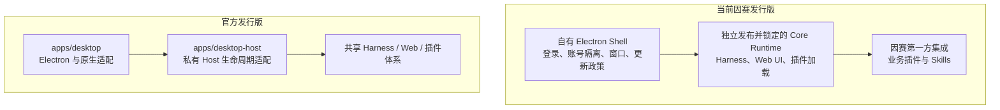
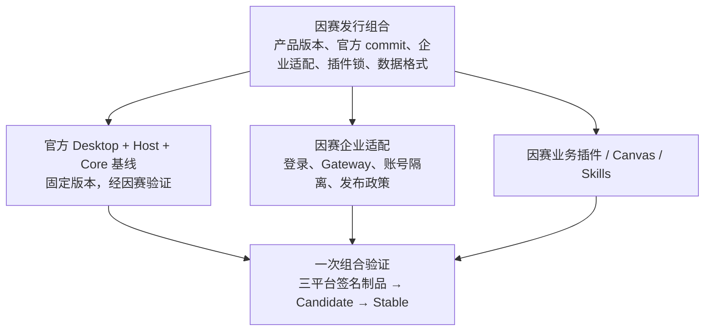

# 因赛AI与 DeepSeek 官方桌面平台：架构、发布与迁移评估

日期：2026-09-30。性质：调研建议，不修改现行 ADR，不授权切换生产客户端。研究范围为桌面平台构建、升级迭代和企业交付；不以模型能力、界面观感或上游提交数量代替可靠性评估。

**结论：保留分层，逐步收敛桌面底座。短期不替换现有生产客户端；中长期优先验证以官方 Desktop 为基础的因赛发行版，将企业身份、数据隔离、发布政策和业务插件保留为自有能力。是否退役现有 Shell，以迁移验证结果和持续维护成本决定。**

不建议直接采用官方原版安装包承接因赛业务，也不建议因“已经投入三层架构”而长期平行维护全部通用桌面能力。最值得减少的是两套桌面实现与跨仓制品装配带来的维护面；Shell、Core、Plugin 的职责分离本身仍然有效。

## 1. 研究基线与证据边界

| 对象 | 本次检查的实际版本 | 含义 |
| --- | --- | --- |
| 因赛 Shell | `0709fb21d811c5924e1dd8a7a67962d6c4390a24`，源码版本 `1.0.3`，2026-09-28 | 源码版本不等于该版本已经全平台正式投放 |
| 因赛 Core | `5f668026071a5c2f2a0796aff1900be62b0aebe4`，Runtime `0.1.6-alpha.2-insight.4` | 与 Shell 当前三个目标的 Runtime lock 相符 |
| 官方仓库 | `639ed015397290b3745d163aafe02ffee4aa3f84`，`0.2.0-rc.2`，2026-09-29 | 本地源码与官方 Releases 页面对应提交一致 |
| 知识库 | ADR-DESKTOP-001、FE-004、客户端与 Canvas 路线等 | 作为决策历史，与当前源码及带日期发布记录交叉检查 |

官方 [Releases](https://github.com/deepseek-ai/deepseek-harness/releases/tag/dsh-v0.2.0-rc.2) 将该版本标为预发行；[项目 README](https://github.com/deepseek-ai/deepseek-harness#developer-preview) 仍说明处于 developer preview，并预告破坏兼容的变化。不能把“官方出品”解释为已提供稳定桌面 SDK、长期支持承诺或企业服务等级保证。

本次完成静态代码分析、Git 差异统计、文档交叉检查与因赛定向测试。未构建官方安装包，未执行 Windows/Intel 实机验证，未迁移生产用户数据，未测量双方启动、内存、下载量或安装耗时。因此下文的工程机制对比有代码依据，实际可靠率与性能排序仍待测。

### 必须纠正的文档时效问题

- 知识库 9 月 26 日截面仍有“Stable 尚未创建”的记录；[因赛 1.0.2 发布记录](/Users/boxser.shi/Documents/harness/insight-desktop-shell/docs/releases/1.0.2.md)已记录 9 月 28 日三平台构建、操作者验收与 Stable 转正。不能继续把我们的发布体系视为尚未走通。
- [1.0.3 记录](/Users/boxser.shi/Documents/harness/insight-desktop-shell/docs/releases/1.0.3.md)只明确本地 DEV 验收，三平台结果待记录；本报告不推断其生产发布状态。
- 官方 Desktop README 的“账号登录尚未接入”与同一文件后文及当前代码的 PKCE 登录实现冲突。应按当前实现判断，同时承认文档有陈旧段落。
- 因赛本地组合开发设计仍写目标命令尚未实现；当前已有 `dev:local`，但其操作的是完整本地 Runtime 副本，不能当作设计中的单包 watch、独立 staging、原子投影方案已经完成。

## 2. 双方架构的真实差别



官方也有 Shell、Host/Core、Plugin，只是把这些放在同一 monorepo 内联动构建和发布。这里需要分开四个问题：

1. **职责分层**：窗口、运行时、业务扩展需要不同所有者，应该保留。
2. **源码组织**：是否三个仓库，与是否分层没有必然关系。
3. **发布单元**：最终给员工的客户端应是经过验证的一组固定组件；双方都采用整体应用更新。
4. **代码维护责任**：当前我们自行维护较多通用桌面与 Runtime 分发实现；官方方案有机会减少这部分责任，但企业适配仍由我们负责。

### 因赛当前机制

[架构说明](/Users/boxser.shi/Documents/harness/insight-desktop-shell/docs/architecture.md)与实现一致：Shell 在构建期下载 Core 制品，按 [Runtime lock](/Users/boxser.shi/Documents/harness/insight-desktop-shell/core-runtime.lock.json) 校验目标、版本、commit 和摘要，装入 `Resources/runtime`。macOS 用 UtilityProcess，Windows 用包内独立 Node。登录后展示当前账号的 Harness WebContentsView。

企业账号由 Main 管理，凭证经 safeStorage 保存；账号目录按环境与稳定账号 ID 的哈希派生。[账号目录实现](/Users/boxser.shi/Documents/harness/insight-desktop-shell/src/main/state/account-scope.ts)和 [WorkspaceLifecycle](/Users/boxser.shi/Documents/harness/insight-desktop-shell/src/main/workspace/workspace-lifecycle.ts)保证账号变化与 Runtime/View 切换串行协调。这些是实际产品资产，不只是“一个壳”。但账号目录隔离不是操作系统级恶意插件沙箱，不能据此宣称任意插件无法读取其他本地文件。

第一方 `@insight-ai/desktop-integration` 位于 Shell 仓库，承担品牌、账号、设置、技能、Gateway 等集成。它虽然采用插件机制，并不意味着已经独立于产品发布；业务模块也不必各自拥有独立更新通道。

### 官方当前机制

[Desktop Host 启动实现](/Users/boxser.shi/Documents/harness/deepseek-harness/apps/desktop/src/host-process.ts)通过 Electron RunAsNode 启动私有 `dsh-desktop-host`，用 Node IPC 交换 ready、fatal、shutdown-complete 和任务状态等消息。[Host 协议版本](/Users/boxser.shi/Documents/harness/deepseek-harness/apps/desktop/src/host-protocol.ts)当前为 4。

主文档先从 `dsh-app://app/` 加载包内 Web 入口，应用请求转发给认证后的 Host。主界面和普通 Web 共用大量实现；平台窗口、快捷键、文件夹对话框、更新确认等由 Electron 适配。

[打包配置](/Users/boxser.shi/Documents/harness/deepseek-harness/apps/desktop/scripts/electron-builder-config.mjs)采用 ASAR，并对原生模块、可执行工具和 Office 引擎配置解包；包内携带 dsh 生产依赖树及独立 Python/Node/pnpm 工作区工具。**Host 使用 Electron Node，并不代表产品没有额外 Node 或无需维护运行时依赖。**

[发布描述](/Users/boxser.shi/Documents/harness/deepseek-harness/apps/desktop/src/release.ts)及 [Core 包集合](/Users/boxser.shi/Documents/harness/deepseek-harness/apps/desktop/src/core-package-set.ts)显式校验发布版本、Host 协议和精确包版本。官方 Desktop、私有 Host 等为仓库内部组合，不能预设其已经是可直接消费的稳定外部桌面 SDK。

## 3. 优劣对比：稳定与快速迭代分别看什么

| 维度 | 当前因赛 | 官方 Desktop | 判断 |
| --- | --- | --- | --- |
| 企业产品控制 | 已有因赛登录、环境与账号隔离、Gateway、产品技能 | 默认围绕 DeepSeek 账号和产品 | 因赛现有能力应保留或明确迁移 |
| 上游演进吸收 | Core 合并、Runtime 发布、Shell 更新锁、插件验证分阶段进行 | Desktop 与 Host/Web/Core 同仓联动 | 官方更适合作为长期通用平台主来源 |
| 依赖确定性 | 独立不可变 Runtime + 哈希锁定 | 同版本发布描述、Core 包闭包和完整性检查 | 双方都有机制；不是“自有确定、官方动态拉最新版” |
| 开发反馈 | Shell 易独立修改；跨 Core/Plugin 修改需要制品组合 | 同仓源码与工具链更容易联动 | 官方具有结构性优势，耗时仍需测量 |
| 更新投放治理 | 签名 Target/Index、按目标 Candidate、三目标验收转 Stable | 当前代码固定 Nightly，配合官方策略服务和 COS | 因赛现有治理更符合自己的企业分发目标 |
| 更新期间的工作保护 | 下载完成后进入安装，停止 workspace/Runtime | 独立重启确认、任务检查、请求准入锁、停止失败恢复 | 官方当前实现更完整，优先借鉴 |
| Windows 安装替换 | 已积累长路径、旧卸载器、进程残留等修复 | 同卷暂存、目录替换、失败尝试恢复旧目录 | 官方机制值得验证，不能承诺消灭断电/占用故障 |
| Windows 代码签名 | 当前 build 关闭更新代码签名验证，采用产品 Manifest 完整性链 | 正式构建要求签名，设置发布者并扫描运行时 PE | 企业设备准入方面官方方案更完整；迁移后仍需自己的证书 |
| 数据恢复 | 数据在安装目录外，整包不覆盖；不自动降级 | 历史格式迁移与读取拒绝机制 | 都不能把二进制回退视为数据回退 |
| 本地扩展安全 | 有受限 preload 和认证回环；插件有 Host 能力 | 有受控协议、IPC 与 guest 管理；Host 与插件同进程 | 都需额外企业插件信任策略；官方不等于隔离每个插件 |
| 性能 | Electron 44，独立 Runtime | Electron 44，ASAR、共享入口、内置大型工具链 | 不能仅按架构判定谁更快、更省内存或包更小 |
| 长期维护 | 两个上游来源加自有插件适配 | 可集中跟随官方，但企业差异形成补丁集 | 只有补丁集持续缩小，迁移才算收益兑现 |

### 3.1 当前三层不是问题，跨层变化的重复成本才是

单独锁定 Core 的好处是：业务技能修复可以保持 Core 不变，遇到上游破坏性变更可以暂缓升级，故障定位能固定输入。1.0.2、1.0.3 就保持同一 Core Runtime。

代价是 Core 能力变化时需要经过“Core 源码验证 → 三平台 Runtime → Shell lock → 集成插件编译 → 三平台安装包 → 旧版本升级验收”。这不是不必要的官僚流程，而是独立制品必须支付的兼容成本。若桌面是 Runtime 的唯一消费者，这个额外发布层的收益会比支持多个宿主时更小。

Git 对比显示，因赛 Core 相对共同上游基线 `ddefc45fbc7f8e46dd73185e68295696d1297887`（2026-09-17，0.1.6-alpha.2）存在 **107 个文件、2474 行新增、433 行删除**。统计包含测试、文档、锁文件和工作流，不等于业务代码行数，也不是合并冲突数。差异涉及 Runtime 闭包、Loader、设置控制、品牌插槽、技能选择和 Windows 子进程。

官方从同一基线到本次检查点，单 `apps/desktop` 与 `apps/desktop-host` 已有 **372 个文件、22555 行新增、2522 行删除**，同样包含测试与文档。这说明桌面底座正在快速发展：既增加可复用价值，也增加跟随变化的风险。它不能证明官方可靠率更高，反而说明不适合让企业 Stable 自动追随主干。

### 3.2 官方最大的优势是端到端生命周期联动

因赛 [安装准备](/Users/boxser.shi/Documents/harness/insight-desktop-shell/src/main/index.ts:1716)停止 workspace；[更新管理器](/Users/boxser.shi/Documents/harness/insight-desktop-shell/src/main/update/update-manager.ts:423)在下载验证完成后自动进入安装；[Runtime 停止](/Users/boxser.shi/Documents/harness/insight-desktop-shell/src/main/runtime/harness-runtime.ts:533)在 Windows 结束进程树，在其他平台先 SIGTERM、超时后 SIGKILL。

当前检查的链路未提供官方那样的“列出活跃任务 → 获得中断确认 → 拒绝新 API → 等待已接收请求 → 再检查任务 → 确认 Host 退出”的完整握手。只结束进程并不等于任务状态已经可靠落盘。这里是在指出实现差异，不是宣称已经发生数据丢失。

官方 [update-tasks.ts](/Users/boxser.shi/Documents/harness/deepseek-harness/apps/desktop-host/src/update-tasks.ts)实际维护 pendingRequests、准入锁和锁代际，检查 agent、排队输入及 job；[update-coordinator.ts](/Users/boxser.shi/Documents/harness/deepseek-harness/apps/desktop/src/update-coordinator.ts)把准备失败与安装交接分离。其主入口还处理 Host 已停止但安装失败后的恢复。

对于运行长任务的企业 AI 客户端，这比多一个原生菜单更有长期价值。无论最终是否换底座，都应优先验证这组能力。

### 3.3 因赛 Update v2 是可保留的优势

[V2ReleaseSource](/Users/boxser.shi/Documents/harness/insight-desktop-shell/src/main/update/v2-release-source.ts)不是简单读取版本号：它验证签名投放信封、Target Manifest、Stable Index 和平台元数据关联，并拒绝撤回 Candidate、目标错配或已观测 Stable 的缺失回放。

[Update v2 设计](/Users/boxser.shi/Documents/harness/insight-desktop-shell/docs/plans/2026-09-22-desktop-update-v2-design.md)把制品身份与投放受众分开：每个目标独立候选验证，三个目标符合条件后让同批字节进入 Stable，避免候选通过后重新构建引入差异。当前发布记录已有 Stable 转正证据。

官方 [更新协调器](/Users/boxser.shi/Documents/harness/deepseek-harness/apps/desktop/src/update-coordinator.ts:69)固定 `nightly`；[更新环境](/Users/boxser.shi/Documents/harness/deepseek-harness/apps/desktop/scripts/desktop-auto-update-environment.mjs)生产地址固定到 `download.deepseek.com`，配套 COS。不是换个产品名就能继承因赛投放规则。

推荐把“选哪个经批准的安装包”与“怎样安全安装它”分开：前者继续由因赛发布治理负责，后者优先使用经验证的官方生命周期实现。但同一客户端只允许一个安装协调器，不能同时运行两套 updater。

双方都选择完整签名应用作为受控更新单元。差分下载是传输优化，不是 Shell、Core、业务插件可以任意独立热更新。ASAR 也不是安全沙箱或性能保证；采用它必须重新验证原生模块、工具路径、插件加载和安装器。

## 4. 直接替换会遇到的五个具体障碍

### 4.1 会话 V3 → V4，安装包降级无法自动恢复数据

因赛 [Session 常量](/Users/boxser.shi/Documents/harness/insight-harness-core/packages/core/session/src/types.ts:88)为 3；官方 [Session 常量](/Users/boxser.shi/Documents/harness/deepseek-harness/packages/core/session/src/types.ts:89)为 4。官方已有历史格式迁移体系，但“官方能迁移其支持的 V3”不等于“因赛的插件事件、附件与旧 Profile 全部已通过”。

应在用户授权的脱敏副本或合成语料上验证会话、事件、附件、设置、插件状态与工作区引用，并保留迁移前快照。新客户端写入 V4 后，旧客户端对新写入数据的可读性不能假定成立。

因赛 `build/update-compatibility.json` 的 schema 1 是产品兼容声明，不能直接等同于 Harness Session V3/V4。引入 V4 时必须明确映射、兼容策略和恢复范围，不得只保持数字 1 不变就视为可以安全退回 Stable。

### 4.2 账号与数据归属不同

因赛按环境和账号选择独立 home；官方 [paths.ts](/Users/boxser.shi/Documents/harness/deepseek-harness/apps/desktop/src/paths.ts)默认从共享 DSH_HOME 派生 `profiles/desktop`，与 CLI 共享受支持产品数据，同时隔离可执行依赖。官方 Platform 内嵌页的账号分区不等于整个本地 Harness 数据已经按因赛租户规则隔离。

迁移必须保留因赛登录、Gateway、退出停机、账号目录与受限凭证桥接，不能简单把旧数据复制进用户 `~/.dsh`。也不能把官方 DeepSeek 账号接入当成企业身份系统的等价替代。

### 4.3 产品插件依赖自有扩展

现有 [第一方集成入口](/Users/boxser.shi/Documents/harness/insight-desktop-shell/packages/insight-desktop-integration/src/client/index.tsx:21)依赖 `settingsDialog`、`sidebar.brand.control`、`conversation.hero.brand.title` 等能力。官方对应包当前没有同名能力；存在 `sidebar.brand.mark/name` 等通用插槽，也不能证明上述集成无需修改。

应逐项判定：官方已有等价能力则适配；通用缺口尝试形成最小上游扩展；因赛专属逻辑保留在产品模块。不应通过 DOM 注入或不断修改官方核心 UI 来追平现状，否则迁移只是更换了一个更大的 fork。

### 4.4 产品版本与平台版本要建立新映射

因赛产品已经使用 `1.0.x`，官方当前是 `0.2.0-rc.2`。现有 updater 禁止降级，不能让生产用户直接“升级”到官方版本号。

应继续使用单调递增的因赛产品版本，记录其对应的官方 commit/Core 版本、Host 协议、插件与数据格式。官方发布描述存在版本一致性断言，因此不能只覆盖 Electron package version；需要在候选验证中确认产品外层版本与内部平台组合的元数据规则，并保留对混装组合的拒绝能力。

### 4.5 应用身份、签名与分发链不能断

已有 App ID、macOS Team/签名身份、safeStorage/钥匙串访问、Windows 安装范围与升级注册信息、userData 路径及更新公钥都属于迁移范围。已有 macOS 身份故障记录说明，改名或换签名不能仅按 UI 变化处理。

应优先从现有更新源投放保持因赛身份的更高版本桥接包，而非让员工手工卸载、删除数据、换装官方原版。如果确需切换更新信任根，须由旧信任链验证迁移配置，不能隐式切换域名或公钥。

## 5. 企业“稳定且高速增长”需要的交付体系

架构选择能减少工作，却不能代替发布运营。企业真正需要的是业务交付速度、事故控制和版本可维护性同时改善。

| 目标 | 应建立的机制 | 现状判断 |
| --- | --- | --- |
| 可重复交付 | 固定平台 commit、依赖锁、签名制品和组件清单 | 双方都有基础，需形成因赛统一发布身份 |
| 可控更新 | Candidate → Stable，按群体分阶段扩大，暂停坏版本 | 因赛已有前两阶段；本次未验证租户/设备比例灰度体系 |
| 不丢工作 | 活跃任务感知、请求停止接收、可靠退出、失败恢复 | 官方更完整，应优先验证引入 |
| 用户数据连续 | 真实旧版本语料、迁移快照、恢复演练 | 不能用空 Profile 启动成功代替 |
| 企业设备可安装 | 平台签名、Windows 发布者验证、受管设备验收 | 因赛 Windows 目前是明确短板 |
| 可观察与支持 | 版本/目标/阶段关联日志，崩溃、升级成功与恢复指标 | 已有本地诊断；未见足够证据证明有完整企业运行指标闭环 |
| 高效研发 | 单命令组合环境、定向检查、可复现跨层失败 | 因赛完整组合方案尚未落地；官方同仓更有利 |
| 可控上游差异 | 补丁台账、兼容检查、固定接收窗口 | 应从按需求救火升级为可衡量日常工作 |

建议对比的指标是：需求合入到可验收候选的时长、热启动/冷启动 P50/P95、构建与签名 P50/P95、实际下载字节、安装到重新可用时长、启动失败率、每次升级中人工修复比例、用户数据恢复失败数、每次吸收上游所需工程时间。先建立基线，再给目标值；本报告不虚构性能提升百分比。

灰度可降低故障影响范围，但不意味着企业一定要增加多个更新器或立即拆分插件热更新。当前三目标齐全才进 Stable 有一致性优势，也会让单平台紧急修复等待其他平台；以后可以评估按平台的紧急通道，须作为显式发布政策变化，而非悄悄绕过现有门禁。

## 6. 方案选择与推荐方向

| 方案 | 短期风险 | 长期维护面 | 适用判断 |
| --- | --- | --- | --- |
| 直接发官方原版，放弃现有客户端 | 高：身份、Gateway、数据、版本、分发均改变 | 通用桌面成本低，企业缺口转嫁给业务 | 不推荐 |
| 永久保留当前全部实现，只追 Core | 短期较低 | 通用桌面与独立 Runtime 装配持续自担 | 可作为退路，不应默认长期最优 |
| 官方 Desktop 源码作为主底座，保留因赛企业适配与插件 | 中：需要明确迁移验证 | 有机会减少通用平台维护，仍需管理补丁 | 推荐的中长期候选 |
| 只摘取官方机制，继续现有 Shell | 较低，可分项验证 | 能解决具体痛点，但重复维护仍存在 | 推荐作为过渡或迁移不经济时的终局 |

目标形态：



这里的“企业适配”是少量职责明确的实现与配置，不建议先建设通用可插拔桌面框架。先证明能够替换官方默认身份、Profile home 与发布源，并保持升级/退出协议完整。

源码可以逐步收敛为一个官方派生平台仓库，业务插件源码继续独立维护；产品发布仍锁定完整组合。如果独立 Core Runtime 只有一个桌面消费者，且新底座已能直接构建同一闭包，可以在迁移通过后退役独立 Runtime 发布流水线。若另有其他真实宿主消费者，则保留制品接口有充分理由。本次没有获得消费者全量清单，因此这一步是条件决策。

## 7. 执行顺序与停止条件

### 第一阶段：不换生产底座，先减少现有交付风险

- 继续用现有 Stable 承接业务；近期不为新通用功能扩大 Shell 自研范围。
- 优先验证任务安全更新、安装失败后恢复可用工作区和 Windows 签名。
- 对每个 Core 定制列明用途、上游是否已有替代、涉及插件、验证用例与删除条件。
- 更新研究所指出的知识库/Runbook 截面差异，形成单一发布状态入口；本报告只提出更新需求，不改写历史证据。

### 第二阶段：有时间上限的官方底座候选验证

建议投入一轮约 10 个工作日的验证预算，不将其当作迁移交付承诺。前提是有人能提供 Windows 与 Intel/Apple Silicon 测试资源及自己的签名环境。交付物必须是保持因赛身份的候选安装包与证据，而不是仅能运行的开发窗口。

最小纵向切片包含：因赛登录 → 当前账号隔离 home → Gateway 发起真实任务 → 技能选择 → 退出与恢复 → 从现有安装版升级到候选。先用独立测试身份和数据副本验证，再决定生产桥接。

同时验证当前三层方案升级到相同官方 Core 的适配成本。否则把“最新 Core 的新能力”全部算成“换桌面底座的收益”，会导致错误归因。

### 第三阶段：满足条件才迁移

| 放行条件 | 需要的证据 |
| --- | --- |
| 业务等价 | 登录、恢复、退出、Gateway、技能和关键业务插件通过；账号 A/B 不串数据 |
| 数据连续 | V3 副本可迁移，附件与插件状态可用；V4 写入后的恢复边界明确 |
| 真正升级 | 三个平台从已安装旧版完成下载、安装和自动重启，保留数据；冷安装另测 |
| 故障恢复 | 下载失败、磁盘不足、文件占用、Host 无响应、安装交接失败均有可用恢复路径 |
| 安全与身份 | 发布者签名、macOS 公证、App ID、钥匙串及更新信任链通过 |
| 可维护性 | 企业修改集中在适配点；一次后续官方更新不要求大量重改 Main/Host/核心 UI |
| 收益可观测 | 组合开发和上游升级所需时间减少，构建/启动/更新指标无不可接受回退 |

若企业接入必须持续大改官方 Main、Host、账号流程和多个核心 UI 包，或官方发布协议无法以小范围适配接入因赛 Update v2，应停止整体迁移，采用“现有 Shell + 经验证官方机制”。停止候选不影响业务主线。

通过后分人群扩大使用，保留旧制品和迁移前数据快照；不要让旧新客户端同时写同一数据目录。回退必须说明新期间产生的数据如何处理，不能简单覆盖旧快照造成静默丢失。最后退役重复的 Shell/Runtime 通用代码与多余流水线，避免永久维护两条产品主线。

## 8. 本次验证记录与最终决策建议

运行命令：

```text
npm test -- test/update-v2-contract.test.ts test/v2-release-source.test.ts test/update-manager.test.ts test/desktop-integration-client.test.ts test/account-scope.test.ts
```

结果：**5 个测试文件、70 个用例通过**。这些定向检查支持当前更新合同、来源处理、更新管理器、集成客户端和账号目录逻辑的分析；不证明整个客户端或官方迁移已完成平台验收。

本次没有修改产品代码、依赖、Runtime lock、账号数据或发布指针。Git 差异统计基于上述固定提交，不能被理解为构建耗时或工程人月估算。线上只核实了官方公开仓库与发布页；因赛发布状态引用仓库内带日期证据，未重新认证所有历史流水线与生产终端。

**建议决策：批准“保留企业控制面与业务插件、验证官方 Desktop 主底座”的方向；不批准立即用官方原版替换，不以删除三层职责为目标。当前客户端继续交付，候选必须证明它减少维护成本，并完整接住既有用户和数据。**

## 参考入口

- [因赛当前架构](/Users/boxser.shi/Documents/harness/insight-desktop-shell/docs/architecture.md)、[认证阶段基线](/Users/boxser.shi/Documents/harness/insight-desktop-shell/docs/authenticated-client-baseline.md)、[本地组合开发设计](/Users/boxser.shi/Documents/harness/insight-desktop-shell/docs/local-composed-development.md)。
- [官方 Desktop 说明](/Users/boxser.shi/Documents/harness/deepseek-harness/apps/desktop/README.zh.md)、[更新验证及局限](/Users/boxser.shi/Documents/harness/deepseek-harness/apps/desktop/tests/README.zh.md)、[真实安装升级验收清单](/Users/boxser.shi/Documents/harness/deepseek-harness/apps/desktop/tests/installed-update/README.zh.md)。
- [官方持久化兼容规则](/Users/boxser.shi/Documents/harness/deepseek-harness/docs/persistence-changes/README.zh.md)。类型检查覆盖结构变更，不等同于全部运行语义或企业插件兼容证明。
- [知识库 ADR-DESKTOP-001](</Users/boxser.shi/Documents/BoxserObsidian-Canvas/04_Decisions/前端架构/ADR-DESKTOP-001 客户端整包更新与参考上游策略.md>)。其“参考上游”主要指 `dataelement/dsh-desktop`，不能机械扩展为永远禁止采用后来成熟的官方 Desktop；重新决策仍须明确保留的产品边界。
- [知识库客户端与 Canvas 路线](</Users/boxser.shi/Documents/BoxserObsidian-Canvas/01_Product/能力地图/DeepSeek Harness客户端与画布插件化目标草案.md>)、[更新实施历史](</Users/boxser.shi/Documents/BoxserObsidian-Canvas/05_Execution/前端研发/INSIGHT-FE-004 因赛AI客户端更新机制与签名候选版实施记录.md>)。
