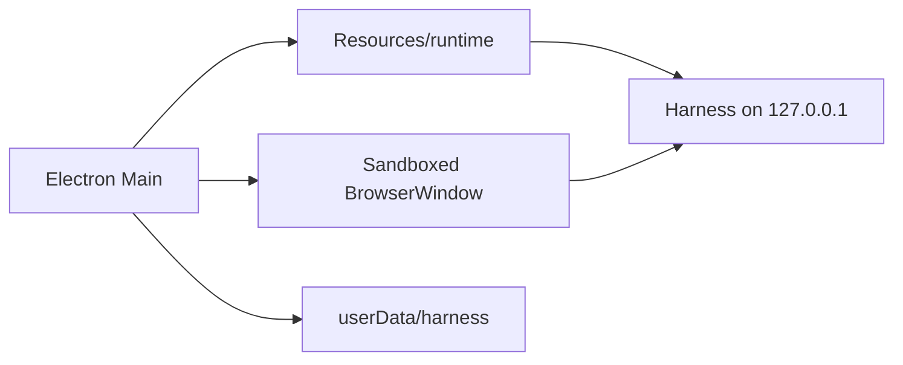

# 因赛AI Desktop 架构

因赛AI Desktop 是 Insight Harness Core Runtime 的 Electron 宿主。Shell 负责桌面窗口、受限 IPC、启动恢复、用户数据目录和安装包；Core Runtime 负责 Harness 运行时及其内部依赖。

登录、账号隔离、单侧栏、统一设置入口和品牌统一完成后的工程现状、提交映射、验证证据及下一阶段入口见 [已认证客户端阶段基线](authenticated-client-baseline.md)。该页是后续业务开发和重大升级开始前的交接入口。

业务阶段的目标架构（登录、受保护业务入口、账号范围数据隔离以及 Harness 工作区的接入边界）见 [业务阶段架构提案](business-stage-architecture.md)。该提案不改变本页记录的已实现 Runtime 边界。

登录后的产品导航采用 Harness 单侧栏和客户端第一方集成插件；窗口所有权、稳定扩展槽、账号桥接及 upstream 约束见 [登录后单侧栏集成设计](plans/2026-08-28-authenticated-sidebar-integration-design.md)。

频繁修改 Shell、Core 模块和独立插件时，开发环境采用 [本地组合开发架构](local-composed-development.md)：Shell 作为唯一组合方，从只读 Runtime 基座派生 DEV Runtime/Profile，只投影选定 package 的构建制品，并在正式构建前完全移除覆盖。该流程缩短反馈时间，但不改变源码平面、Runtime 制品和正式 Profile 的所有权。

## 运行时边界

`core-runtime.lock.json` 锁定 GitHub Release 中不可变的 Core Runtime 制品。Shell 构建时下载并校验该制品，正式安装包将其复制到 `Resources/runtime`。因此 Shell 不在 `package.json` 中声明或升级 `@deepseek-ai/dsh` registry 依赖；Core 的升级必须显式更新锁定文件并完成验证。

macOS 通过 Electron UtilityProcess 启动 Harness，Windows 使用随 Core Runtime 打包的目标平台 Node.js。两者均不向渲染进程暴露 Node 权限。

## 数据与插件

Profile、插件、工作区和会话都位于应用安装目录之外，升级不会覆盖它们。默认 Better Sidebar Profile 随安装包提供；用户仍可显式导入本地插件。启动失败时，恢复流程和 Safe Mode 只处理 Profile，不删除用户工作区或会话。

## 升级上游

Shell 定期合并 `dataelement/dsh-desktop` 的宿主能力。解决冲突时必须保留 Core Runtime 锁定、`Resources/runtime` 资源路径、内置 Profile、用户数据隔离、未登录全屏 Shell、登录后全窗口 Harness View 和第一方集成插件；不恢复 Shell 对 registry DSH 包或其 `patch-package` 文件的直接依赖。
