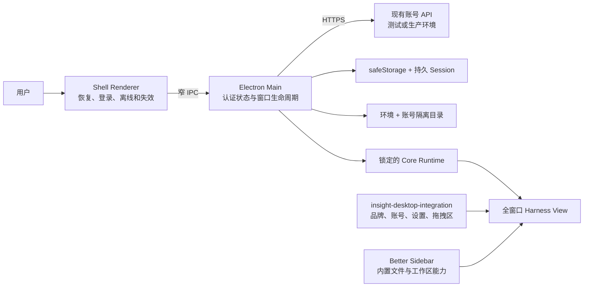

# 因赛AI已认证客户端阶段基线

> 状态：active（2026-08-28）
>
> 本页记录登录、账号隔离、登录后单侧栏、统一设置入口和品牌资产统一完成后的工程现状。它是下一阶段业务开发及后续 upstream/Core Runtime 升级的交接入口；专题设计继续分别维护各自约束。

## 阶段结论

因赛AI Desktop 已从“直接启动通用 Harness 的桌面宿主”进入“由登录状态控制的品牌化客户端”：未认证时只有 Shell 登录与恢复界面，认证成功后加载当前账号独立的 Core Runtime Profile，并以 Harness 原生侧栏作为唯一工作区导航。

本阶段已经完成并由用户手工确认：登录、启动恢复、退出、多账号会话数据隔离、登录后单侧栏、账号摘要、统一设置入口、Better Sidebar 文件打开能力和主要品牌界面。下一阶段应开始接入真实业务能力，不继续扩张 Shell 或 Core 的通用架构。

本页不替代以下专题文档：

- [桌面登录架构设计](plans/2026-08-28-desktop-auth-architecture-design.md)：认证状态、凭证、API 环境和账号数据隔离。
- [登录后单侧栏集成设计](plans/2026-08-28-authenticated-sidebar-integration-design.md)：窗口所有权、第一方集成插件、账号菜单、设置和 upstream 约束。
- [品牌资产统一设计](plans/2026-08-28-brand-assets-unification-design.md)：品牌源文件、派生图标、展示位置和构建规则。
- [客户端构建 Runbook](client-build-runbook.md)：从定向检查到安装包和 GitHub Actions 的验证曲线。
- [本地组合开发架构](local-composed-development.md)：未来的 Shell/Core/插件快速联调接口；其中命令尚未实现。

## 当前运行结构



### 组件所有权

| 组件 | 当前职责 | 不得扩张为 |
| --- | --- | --- |
| Shell Renderer | 登录表单、恢复/离线/失效状态和认证前全屏界面 | token 存储、业务授权或登录后第二条侧栏 |
| Electron Main | API 调用、认证状态唯一写入、凭证保存、账号范围派生、Runtime 和 View 生命周期 | 企业账号权威或业务数据服务 |
| Shell preload | 向登录页面暴露经过校验的认证动作与状态 | 任意网络、文件系统或 Runtime 控制接口 |
| Harness preload | 向受信任主 frame 暴露账号摘要、客户端信息、设置和退出的窄桥接 | token、Cookie、真实账号 ID 或目录路径 |
| Core Runtime | Harness、公开 UI 扩展槽、设置控制和插件运行 | 登录、产品路由或因赛AI业务权限 |
| `insight-desktop-integration` | 随 Shell 发布的品牌、账号入口、客户端设置区和 macOS 拖拽覆盖层 | 可卸载第三方插件或对 Harness DOM 的私有补丁 |
| Better Sidebar | 出厂 Profile 中的文件、终端、Git 和 Markdown/HTML 内置打开能力 | 登录、账号菜单或业务授权来源 |

## 登录与会话实现

### API 与环境

Main 复用现有账号服务的验证码、图形验证码、登录、刷新、用户详情和退出能力。开发通道固定使用测试环境，正式包固定使用生产环境；环境由构建通道选择，Renderer 和普通用户不能修改 API 基址。认证 Cookie、加密状态和账号目录同时按环境分区，防止测试与生产会话交叉。

旧 Web 项目只在设计阶段作为接口行为参考。Shell 不引用其源码、不复制其组件、不加载其页面，也不与其构建产物建立依赖。

### 状态与生命周期

Renderer 只接收 `restoring`、`unauthenticated`、`authenticating`、`authenticated`、`offline` 和 `expired` 等界面状态以及渲染安全的账号摘要。访问令牌、Cookie、密码和验证码不进入 Renderer 持久状态、Harness Profile 或日志。

启动时先恢复并验证会话，只有认证成功后才启动当前账号 Runtime 和 Harness View。退出时先撤下 View、停止 Runtime，再清除当前环境的本地凭证并显示全屏登录页；远端退出失败不阻止本地撤销。网络错误与会话失效分开处理，离线状态不凭本地缓存授权进入 Harness。

### 账号隔离

账号目录由环境和稳定账号 ID 派生的不可逆键选择。账号摘要不包含该稳定 ID；Harness 和第三方插件也不能读取目录路径。

```text
<userData>/insight/
  auth/                         # 按环境分区的加密认证状态
  plugins/packages/             # 设备级共享的插件代码和版本
  plugins/registry.json         # 设备级插件目录
  accounts/<account-scope>/
    shell/                      # 当前账号非敏感 Shell 状态
    harness/                    # 对话、Profile、插件配置与状态
    cache/                      # 当前账号可清理缓存和本地产物
```

用户主动导入的插件包在设备内共享；插件启用状态、配置、密钥、缓存、会话和业务资产按账号隔离。退出保留账号目录，再次登录同一账号可以继续使用自己的数据；其他账号不能复用该目录。旧设备级 Profile 不自动归属给首个登录账号。

## 登录后单侧栏与设置

认证成功后 Harness `WebContentsView` 覆盖整个窗口内容区，Shell Renderer 留在后方但不占可见宽度。Harness 原生侧栏是唯一导航，第一方 `insight-desktop-integration` 只使用公开扩展槽提供：

- `sidebar.brand.mark` 与 `sidebar.brand.name`：因赛AI品牌；
- `sidebar.footer.action`：账号头像、昵称、脱敏手机号以及账号菜单；
- `settings.trigger`：遮蔽重复的原生设置触发行；
- `settings.section`：客户端信息设置区；
- `shell.overlay`：macOS 窗口拖拽覆盖层。

账号菜单通过 React Portal 渲染到文档根节点，避免侧栏折叠或 `overflow` 裁剪。菜单中的“设置”打开完整 Harness 设置中心，“退出”执行本地会话撤销。底部不再显示第二个设置按钮；“设置”表示系统和客户端设置，账号资料设置仍不在当前范围。

Core 只增加产品无关的设置对话框控制能力，并在自定义 trigger 为空时保持设置宿主挂载。Shell 不查询 Harness DOM、不模拟点击、不覆盖私有布局选择器。若 Core 扩展槽或设置控制能力不兼容，集成契约测试必须在打包前失败。

## 品牌资产

Shell 只维护两个可编辑 SVG 源：

| 文件 | 用途 |
| --- | --- |
| `build/brand-mark.svg` | 登录页、侧栏和小尺寸图形标 |
| `build/brand-wordmark.svg` | 启动页等宽幅“图形标 + 因赛AI”组合 |

`build/app-icon.png` 是 1024×1024 系统图标位图源，`scripts/generate-app-icons.mjs` 从它生成 `build/icon.icns` 和 `build/icon.ico`。启动页、登录页、侧栏、插件恢复、安全模式、Dock、任务栏和安装包均改用因赛AI品牌。旧鲸鱼图标、明暗重复 Logo 和 loader GIF 已从 Shell 品牌目录及打包资源中删除。

Core Runtime 的 `@deepseek-ai/*` 技术包名和历史技术夹具不属于产品视觉，不做重命名。未来 Core 页面若显示 upstream Logo，应通过公开 UI 插槽覆盖，不能修改下载后的 Runtime 制品。

## 2026-08-28 提交映射

### 认证与账号隔离

| 提交 | 作用 |
| --- | --- |
| `8383111`、`14f2c15` | 批准桌面认证架构并制定实现计划。 |
| `971eaa6`、`ab8f4b7` | 建立 Main 认证 API 边界、加密持久化和启动恢复。 |
| `1a79090` | 按环境与账号范围隔离 Harness 数据。 |
| `b9d01a6`、`3ee2fcd` | 增加全屏登录 Renderer 和受限认证 IPC。 |
| `9085b2e`、`c278d05` | 认证后挂载账号范围 Harness View，未认证时禁止启动工作区。 |
| `e424390`、`afad2c7` | 恢复开发模式并修正登录校验与 DEV Runtime 路径。 |

### 单侧栏与设置

| 提交 | 作用 |
| --- | --- |
| `76f89e3`、`aa01d5a` | 固化登录后单侧栏、账号桥接和 upstream 约束。 |
| `e25bb81`、`9a47a12`、`da69d3b`、`ee4c9f7` | 构建并预装第一方桌面集成，接入账号、品牌、设置和导航扩展槽。 |
| `b7d5170`、`dd3f318` | 让全窗口 Harness 成为认证后唯一界面并增加集成契约门禁。 |
| `bce111b`、`74a7292`、`11970bf`、`5444b10` | 将账号菜单设为唯一设置入口，并刷新内置集成制品。 |
| `c1e8bae` | 修复账号菜单裁剪和设置对话框宿主缺失。 |
| Core `d34826e679` | 以产品无关方式在 trigger 为空时保留设置宿主。 |

### 品牌统一

| 提交 | 作用 |
| --- | --- |
| `c5daae2`、`c05ef23` | 固化品牌源、使用规则、构建约束和实施计划。 |
| `14298ad` | 建立两个 SVG 品牌源并移除旧 Logo、loader 和重复资源。 |
| `95ae6e6` | 将因赛AI品牌接入登录、侧栏、恢复和安全模式等界面。 |
| `9336eac` | 重新生成 PNG、ICNS、ICO，并将有效 iconset 的 host `iconutil` 异常写入 Runbook。 |

## 验证证据

证据状态含义：

- `passed-automatic`：仓库自动检查通过；
- `passed-by-user`：用户在指定本地客户端中实际操作确认；
- `not-yet-verified`：设计或代码已完成，但本轮尚无对应运行证据。

| 能力 | 状态 | 证据 |
| --- | --- | --- |
| Shell 全量测试 | passed-automatic | `56` 个测试文件、`336` 个测试通过。 |
| Shell 类型检查 | passed-automatic | `npm run typecheck` 通过。 |
| Renderer/Main/集成插件构建 | passed-automatic | `npm run build:prepared` 通过。 |
| 未登录全屏登录与登录成功进入 Harness | passed-by-user | 用户在本地 DEV 客户端完成登录并进入工作区。 |
| 启动恢复 | passed-by-user | 退出客户端后重新进入，无需重复登录。 |
| 退出 | passed-by-user | 退出登录后回到全屏登录页。 |
| 多账号隔离 | passed-by-user | 多账号切换后会话数据完全隔离。 |
| 登录后单侧栏 | passed-by-user | 不再出现 Shell 与 Harness 两条并列侧栏。 |
| 账号摘要、菜单和设置 | passed-by-user | 左下角用户信息、菜单、完整设置中心可用，重复设置入口已隐藏。 |
| Better Sidebar | passed-by-user | 会话内 Markdown 与 HTML 继续在内置 Sidebar 打开。 |
| 因赛AI主要品牌界面 | passed-by-user | 新应用图标、登录页、侧栏和主题显示完成手工验收。 |
| 离线、过期、账号禁用和运行中权限变化 | not-yet-verified | 自动状态覆盖存在，但尚缺本轮服务端真实场景人工验收。 |
| 品牌变更后的目录应用和 DMG | not-yet-verified | DEV 验收已通过，尚未执行本轮安装包品牌回归。 |
| Windows 新应用图标和认证安装包 | not-yet-verified | 需要 Windows Runner 及目标系统人工确认。 |
| macOS 正式签名、公证和 stapling | not-yet-verified | 当前仍是研发分发门禁，上线前单独完成。 |

## 升级与回归规则

1. Shell upstream、Core Runtime lock、Better Sidebar、第一方集成插件和品牌资源一次只改变一个输入，并使用独立提交。
2. Shell upstream 合并后必须保护认证前全屏 Shell、认证后全窗口 Harness View、账号目录、Runtime lock、bundled Profile、产品 App ID 和品牌源。
3. Core Runtime 升级先检查公开 UI slots、设置对话框控制、账号 preload 所需接口和 Utility Process 插件加载，再更新 Shell lock。
4. 第一方集成只使用公开扩展槽和窄账号桥接；出现兼容问题不得改回 DOM 注入、模拟点击或私有 CSS 覆盖。
5. 每轮先运行定向测试、全量测试、类型检查和普通 build，再启动精确的新 DEV 实例等待人工验收。
6. DEV 人工验收至少覆盖登录、恢复、退出、单侧栏、设置和 Markdown/HTML；失败时停止，不构建目录应用或安装包。
7. DEV 通过后才进入目录应用、DMG 和 GitHub 原生平台包。新的构建陷阱追加到 [客户端构建 Runbook](client-build-runbook.md)，单次时间线进入 `docs/incidents/`。

## 已知范围与后续项

- 注册、忘记密码、直接账号切换、企业切换、账号资料设置和 Design Tokens 不在本阶段范围。
- 用户导入的插件代码按设备共享；其配置、密钥、缓存和业务数据继续按账号隔离。
- 当前样式沿用 Harness 的双主题基础。统一视觉审计和跨 Shell/Core/插件 Design Tokens 后置，不阻塞业务接入。
- [本地组合开发架构](local-composed-development.md) 已批准，但 `dev:shell`、`dev:core`、`dev:plugin`、`dev:reset` 和 `verify:release` 尚未实现，不能作为当前命令使用。
- 现有账号服务已能支撑当前登录切片，但账号禁用、权限变化、跨设备和长期接口兼容仍需 Product 与 Backend 形成正式契约。

## 下一阶段入口

登录切片已经达到进入业务层的条件。下一阶段首先由 Product 明确一个真实、可验收的电商业务任务，包括用户目标、输入、产物、失败状态和成功标准；Frontend 与 Backend 再为该任务确认最小业务 API、权限和 Artifact 范围。

业务能力应作为独立产品模块或第一方能力接入，继续复用本页的认证状态、账号隔离和工作区边界。不得为了一个业务页面让 Core 接管身份、把业务 token 交给第三方插件、恢复第二条 Shell 侧栏，或继续用通用架构建设替代真实业务交付。
