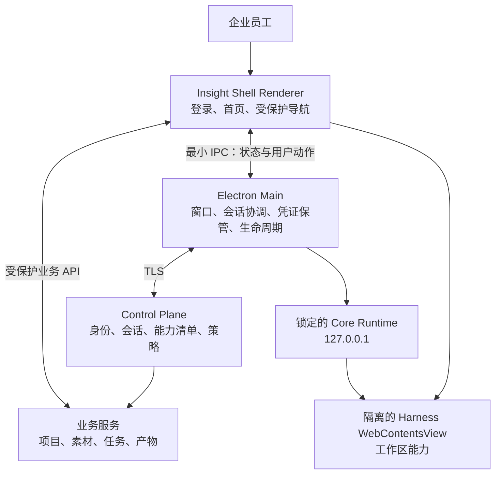
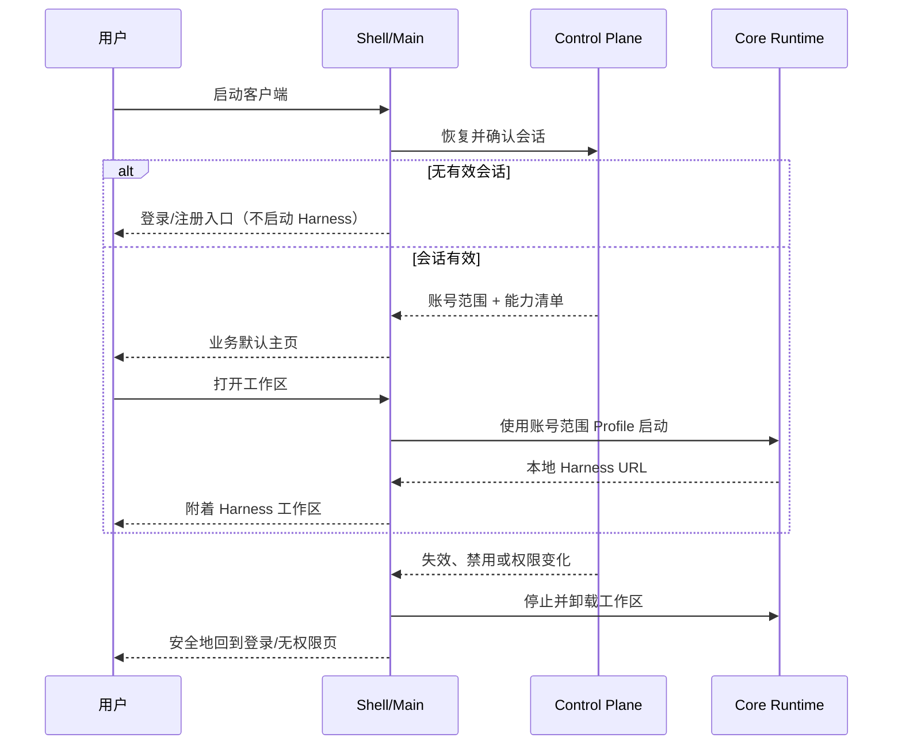

# 因赛AI业务阶段架构提案

> 状态：proposed（2026-08-27）
> 依据：`docs/architecture.md`、`docs/phase-2-handoff.md`，以及知识库 2026-08-26 的登录与业务阶段记录。
> 本文不定义身份供应商、令牌字段、后端 API 或首个电商 Brief；这些仍须由产品与后端确认。

## 结论

现有 `Shell + Core Runtime` 的运行时边界已经成立，但它只能作为桌面宿主基线：主窗口启动后直接加载本地 Harness。下一阶段应新增受服务端控制的产品层，而不是把登录、租户、业务数据或权限补丁写进 Harness Profile。

目标拓扑为：



`Shell Renderer` 是产品 UI 的唯一入口；`HarnessView` 是其中一个工作区，而不是应用首页。Core Runtime 仍只负责本地 Harness、插件和运行时能力。Control Plane 与业务服务才是身份、租户、授权和业务数据范围的权威来源。

## 已确认的工程事实

| 层 | 已实现职责 | 不应扩张为 |
| --- | --- | --- |
| Electron Shell | 安全窗口、启动/恢复、安装包、`userData`、受限 IPC、Core 生命周期 | 身份权威、租户授权、业务数据库 |
| Core Runtime | 固定版本的 Harness、本地回环服务、插件运行和工作区能力 | 企业账号系统、业务权限策略 |
| Better Sidebar | 文件、终端、Git 和 Harness 工作台体验 | 企业能力目录或账号权限来源 |
| Control Plane（待建） | 身份、会话、能力配置、账号/企业范围和策略判定 | 本地 Runtime 的打包与启动 |
| 业务服务（待建） | 电商业务对象、素材、任务、生成物及审计 | Electron 原生窗口和本地插件管理 |

Shell 已将 Core Runtime 锁定到可校验的制品，并将可变 Harness 数据保存于 `userData/insight/harness`。这是设备级隔离，不满足多账号、租户或退出后防复用的业务隔离要求。

## 推荐的应用边界

### 1. Shell Renderer 与 Harness 的组合方式

Shell 应改为加载自身的 Renderer，并通过应用路由显示以下区域：

- 未登录：仅显示登录、注册/受邀说明和必要的故障恢复。
- 已登录：业务默认主页、账号入口和由服务端能力清单决定的导航。
- 工作区：将已启动的 `127.0.0.1` Harness 作为 `WebContentsView` 附着在 Shell 的受保护路由中。

不要继续在同一个主窗口里把 URL 整体导航至 Harness，也不要使用 `iframe` 或 `webview`。前者会让登录层消失，后两者会扩大渲染进程与导航的信任边界。现有项目已使用 `WebContentsView` 承载 Windows 菜单，因此这是与当前 Electron 基线一致的隔离方式。

Harness 仅在用户进入获授权的工作区时启动或显示；未登录阶段不启动它。离开工作区可隐藏 View 并停止 Runtime；退出、失效、禁用或能力被撤销时必须先停止/卸载 View，再清空 Shell 的受保护状态。

### 2. 登录、注册与会话

首版客户端不保存用户密码，也不在本地实现账号注册。注册、邀请兑换、密码重置、企业 SSO 和风控均由服务端托管的身份页面完成。桌面端只发起交互式登录并接收完成结果。

身份源尚未确定。若最终采用 OIDC/OAuth 型企业身份，推荐系统浏览器中的 Authorization Code + PKCE，并以已注册的应用回调把结果带回 Electron。无论最终协议为何，都必须满足：

- 原始长期凭证只由 Main 进程保存，并使用操作系统安全存储；Shell Renderer、Harness 和插件只能看到派生后的状态或短期、受限能力。
- Renderer 通过 IPC 只获取状态快照：`恢复中`、`未登录`、`登录中`、`已登录`、`会话失效`、`无权限/禁用`；不获取 token。
- 服务端是最终授权方。Shell 的路由拦截是体验与风险收敛，不能替代业务 API 的鉴权。
- 退出、禁用、权限变化和会话失效都走同一条“撤销本地访问”路径；网络故障不能被误报为失效。

### 3. 按账号/企业隔离本地状态

现有 `userData/insight/harness` 不能再直接用于已登录业务用户。完成会话恢复并得到服务端确认的稳定账号范围后，Main 才能选择该范围的本地 Profile：

```text
<userData>/insight/
  launch-root/                         # 设备级、无业务数据
  accounts/<opaque-account-scope>/
    shell/                              # 该账号的非敏感 UI 状态与缓存
    harness/                            # 该账号范围的 Profile、会话、插件状态
    cache/                              # 可清理的业务缓存
```

`opaque-account-scope` 必须由可信账号/企业范围派生并避免暴露原始用户或租户标识；具体算法由安全方案确定。不得以可编辑的本地 user ID、窗口缓存或设备目录作为授权依据。

迁移规则：旧设备级 `insight/harness` 不自动并入任意账号范围。首次接入时只创建新范围；旧目录的处理须由产品和安全策略明确，避免把用户 A 的会话、模型配置或插件状态带给用户 B。

### 4. 能力、插件与业务数据

登录成功后，Shell 必须先获得服务端的启动信息，再显示受保护页面。该信息在概念上包含：当前账号摘要、企业范围、可见业务能力、版本/过期信息和策略变化信号；字段和接口名称仍由跨端契约确定。

因此：

- 业务首页及其入口由“业务默认能力”决定，不能从本地插件列表、Harness 设置或角色缓存推断。
- 不把主会话 token 写入 Harness Profile、插件配置或 Renderer 的 localStorage。首方 Harness/Canvas 集成若需访问业务服务，只能使用面向明确受众和最小权限签发的短期能力；业务服务仍需逐请求鉴权。
- 员工可见的 Settings、插件导入、模型配置和开发者工具由服务端能力与产品决策共同控制。隐藏入口不是授权；服务端仍必须拒绝未授权请求。
- 首个业务垂直切片应收敛为一个真实电商任务。知识库当前候选为 Campaign Pack，但真实 Brief、输入、产物和失败例尚未提供，故不能提前做出大量业务页面。

## 启动与失效流程



## 决策门与责任人

在以下问题关闭前，不应写正式登录 API、令牌存储或业务页面实现：

| 决策门 | 需要的确定结果 | Owner | 阻塞内容 |
| --- | --- | --- | --- |
| D17 身份源与账号生命周期 | 身份源、注册/邀请路径、登录/退出/续期/禁用/企业切换/离线语义 | Product + Backend | 认证流程、会话持久化、数据清理策略 |
| 登录契约 | 启动恢复结果、错误分类、能力清单、策略变更与兼容规则 | Frontend + Backend | IPC 接口、状态机、联调与测试桩 |
| D18 可见能力 | 首个员工用户能看到的业务入口和受控的 Harness 通用入口 | Product + Frontend | Shell 导航、菜单、插件和设置收敛 |
| 首个真实电商 Brief | 输入、约束、目标产物、失败例和验收路径 | Product | 业务首页与首条端到端链路 |
| D9/D10/D13-D16 | 客户端与 Canvas 的发布范围、入口对象关系及 Harness 插件边界 | Product + Frontend + Backend | Canvas/生成物集成与插件契约 |

## 落地顺序

1. 先确认 D17 与登录契约，并将知识库的 draft 推进为已审阅契约快照。
2. 在 Shell 内建立独立 Renderer、会话状态机和受保护路由；先覆盖“恢复中/未登录/已登录/失效/无权限”，不接入模拟正式身份。
3. 将现有直接 `loadURL(Harness)` 的工作区模式替换为受保护的 `WebContentsView` 挂载，并把 Harness Profile 选择改为账号范围。
4. 接入服务端能力清单，收敛普通员工可见的菜单、Settings、插件和模型入口。
5. 以一个已确认的电商 Brief 实现业务默认主页和一条可验收的任务链路；Canvas/生成物联动另立契约和工作包。
6. 每一步均保留 Runtime lock、Profile 恢复和 macOS/Windows 打包回归；登录或业务功能不能反向改写 Core 的打包所有权。

## 验收基线

- 无有效会话时，业务数据、Harness 工作区及其本地导航均不可见。
- 有效会话恢复完成后只显示当前账号/企业允许的首页和能力。
- 账号 A 退出或失效后，账号 B 无法通过内存、路由或旧 Harness Profile 复用 A 的受保护状态。
- 网络故障、会话失效、账号禁用和无权限在界面上可区分，且都有明确恢复路径。
- macOS 与 Windows 的安装、启动、Runtime 校验、Better Sidebar 基础能力和安全恢复不回归。
