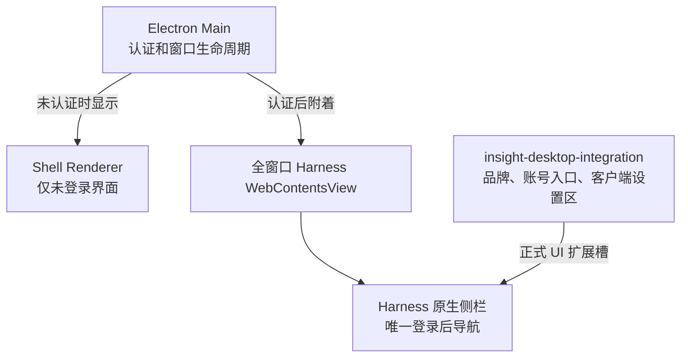

# 登录后单侧栏集成设计

> 状态：approved（2026-08-28）
>
> 本文是登录后窗口布局、产品导航、账号入口和设置入口的权威设计。它取代 [因赛AI桌面登录架构设计](2026-08-28-desktop-auth-architecture-design.md) 中原有的最小 Shell 侧栏和 Shell/Harness 双设置方案；认证状态机、凭证安全和账号数据隔离仍由原文定义。

## 决策

未登录时，Shell Renderer 独占窗口并显示恢复、登录、离线或失效状态。登录成功后，Harness `WebContentsView` 覆盖整个窗口内容区，Harness 原生左侧栏成为唯一可见导航。Shell Renderer 保留在窗口后方，但不占用可见宽度。

因赛AI产品入口通过随客户端发布的第一方 `insight-desktop-integration` 插件注册到 Core Runtime 的正式 UI 扩展槽。不得为合并侧栏修改 Harness 侧栏布局、查询或点击 Harness DOM、覆盖私有 CSS 选择器，或把账号入口塞入 Better Sidebar。

## 目标与非目标

本设计需要实现：

- 登录后只显示一条左侧栏；
- 使用因赛AI品牌替换 Harness 默认品牌；
- 在 Harness 侧栏底部显示当前用户摘要，以及“设置”和“退出”操作；
- 账号菜单中的“设置”是侧栏内唯一可见设置入口，并打开完整客户端设置中心；
- 保留 Harness 侧栏折叠、目录选择、安全模式、插件恢复和 Better Sidebar 行为；
- 把产品代码与两个 upstream 工程的内部 DOM 和布局实现隔离。

首版不实现账号资料、安全中心、余额、账号切换或新的视觉规范。当前“设置”只表示系统和客户端设置；账号设置后续另行设计。

## 窗口与界面所有权

Shell 不再维护登录后的产品侧栏，也不再由 Renderer 上报一个为侧栏预留宽度的工作区矩形。认证成功后，Main 按窗口内容区设置 Harness View 边界，并在窗口调整时同步更新。退出或会话失效时，Main 立即撤下 Harness View，再显示全屏登录界面。

macOS 窗口拖拽区域必须由 Harness 页面通过正式 `shell.overlay` 扩展槽提供。不能依赖被全窗口 Harness View 覆盖的 Shell Renderer 拖拽层。

## 第一方桌面集成插件

`insight-desktop-integration` 属于客户端产品代码，由 Shell 仓库维护并随安装包及默认 Profile 一起交付。它不是从 GitHub 或 registry 运行时下载的第三方插件，不出现在用户可卸载插件清单中，也不能被普通第三方插件恢复流程移除。

插件只使用 Core Runtime 已公开的扩展槽：

| 能力 | 扩展槽 |
| --- | --- |
| 品牌图标 | `sidebar.brand.mark` |
| 品牌名称 | `sidebar.brand.name` |
| 账号摘要与菜单 | `sidebar.footer.action` |
| 隐藏 Harness 原生设置入口 | `settings.trigger` |
| 客户端设置内容 | `settings.section` |
| macOS 拖拽覆盖层 | `shell.overlay` |

Harness 设置插件继续注册 `sidebar.settings`、设置弹窗和所有设置区。第一方桌面集成插件以更低的正式槽位优先级注册一个空 `settings.trigger` 组件，只遮蔽侧栏底部的原生触发行；不得替换或禁用 `sidebar.settings`，否则会连同设置对话框宿主和控制服务一起卸载。账号菜单中的“设置”是侧栏内唯一可见入口，并通过通用设置对话框控制服务打开完整设置中心。Core 提供最小、产品无关、可公开验证的设置对话框控制服务，并在触发器为空时保持设置宿主挂载；产品插件不得通过模拟 DOM 点击实现这一行为。

账号菜单通过 React Portal 渲染到 Harness 文档根节点，并根据账号按钮的视口坐标使用 fixed 定位。菜单不得留在侧栏的 `overflow` 裁剪层级内，也不得通过修改 Harness 私有布局或提高局部 `z-index` 规避裁剪；展开和折叠状态共享同一菜单实现。

设置中心首版新增“客户端”区，用于显示版本、发布通道和环境等非敏感客户端信息。账号资料编辑不属于该设置区。

## 账号桥接与安全

Electron Main 继续是认证会话的唯一写入者。Harness preload 只向受信任的 Harness 主 frame 暴露窄账号桥接：

- 读取渲染安全的 `AccountSummary`；
- 订阅登录摘要或会话失效事件；
- 请求退出当前账号；
- 读取显示所需的非敏感客户端信息。

桥接不得暴露访问令牌、刷新令牌、Cookie、真实账号 ID、账号目录路径或任意文件系统能力。Main 必须校验 IPC 发送者是当前活动 Harness View 的主 frame。第三方插件不能直接获得认证 IPC；第一方插件只能通过 Harness preload 的限定接口使用上述能力。

用户导入的插件包和版本继续按设备共享；插件启用状态、配置、密钥、缓存、对话和业务资产继续按账号隔离。本设计不改变该数据所有权。

## 生命周期

登录成功后的顺序是：

1. Main 持久化加密会话并派生账号范围；
2. Main 启动该账号的 Core Runtime；
3. Main 创建带受限 Harness preload 的全窗口 View；
4. Harness 加载默认 Profile，第一方集成插件注册品牌、账号入口和客户端设置区；
5. Main 隐藏登录界面并显示 Harness View。

退出、会话失效或异地登录后的本地撤销顺序是：

1. 立即拒绝重复退出，并隐藏或销毁 Harness View，防止旧账号继续操作；
2. 在限定时间内停止 Runtime，超时后强制结束其进程；
3. 清除当前环境的本地凭证和内存账号范围；
4. 保留该账号的本地数据目录；
5. 显示全屏登录界面。

退出接口失败不阻止本地撤销。启动时无法在线验证会话则显示离线恢复页，不启动或显示 Harness。

## 降级与逃生路径

- 第一方集成插件加载失败时，Harness 原生侧栏仍应可用；原生应用菜单必须保留“退出当前账号”作为逃生入口。
- Core 缺少所需扩展槽或设置控制能力时，兼容性测试和构建门禁必须失败。不得临时回退到 DOM 注入。
- Safe Mode 不应把第一方桌面集成视为可卸载第三方插件；即使集成界面不可用，也必须保留原生退出入口。
- Better Sidebar 失败继续使用既有插件恢复流程，不得影响登录、设置或退出。
- 账号桥接不可用时，账号入口显示明确的不可用状态，不显示缓存的其他账号信息。

## Upstream 设计约束

`dataelement/dsh-desktop` 只作为参考上游。本方案允许定向采用小型、显式、可测试的 upstream 接口扩展，但禁止整体合并上游或进行侵入式布局修改。

### 必须保持

- Shell `src/main/index.ts`、preload 和窗口代码只做薄装配；认证、工作区和集成插件分别维护。
- Core 只增加产品无关的设置对话框控制服务，不承载因赛AI账号模型、品牌或 API。
- Shell 继续通过 `core-runtime.lock.json` 主动锁定 Runtime；Core upstream 或 `@deepseek-ai/dsh` 更新不得自动升级客户端。
- 产品集成只依赖列出的稳定扩展槽和窄 preload 接口。
- Better Sidebar 保持独立，不承担产品导航和账号功能。

### 明确禁止

- 修改或复制 Harness 侧栏布局源码来实现产品入口；
- 通过 DOM 选择器、模拟点击、私有路由或全局 CSS 操纵 upstream 页面；
- 让 Core Runtime 读取桌面访问令牌或接管登录生命周期；
- 把用户导入的插件包改为账号级重复安装；
- 在同一升级批次同时定向采用 Shell upstream 变更和更新 Core Runtime 锁。

### 升级决策矩阵

| 变更来源 | 合并前必须确认 | 不兼容时的处理 |
| --- | --- | --- |
| Shell upstream 的窗口、preload 或 `WebContentsView` | 未登录全屏、登录后全窗口 View、IPC 发送者校验、原生退出入口仍成立 | 在独立适配层解决；不把产品逻辑重新写入 upstream 布局 |
| Core upstream 的侧栏或设置 UI | 六个扩展槽、`settings.trigger` 优先级遮蔽、设置宿主保活、设置控制服务和插件生命周期测试通过 | 暂停更新 Runtime 锁；先在 Core 提供兼容接口或更新第一方适配插件 |
| Core Runtime 制品版本 | manifest、目标平台、第一方插件和默认 Profile 契约一致 | 保持当前锁定版本，不随 upstream 自动升级 |
| Better Sidebar 版本 | Markdown/HTML 打开、恢复和 Safe Mode 不回归 | 单独修复或回退 Sidebar；不改变账号集成 |

Shell upstream 定向采用与 Core Runtime 升级必须拆成两个可独立回退的提交和验证批次。每次只改变一个上游输入，先完成本地 DEV 人工验收，再决定是否生成安装包或触发 GitHub 平台构建。

## 验证曲线

从低成本到高成本依次验证，任一阶段失败即停止：

1. 运行扩展槽、设置控制服务、账号 IPC、边界计算和账号隔离的定向测试；
2. 运行 Shell `npm run typecheck`、`npm test` 和普通 build；Core 变更运行其受影响包检查；
3. 本地 DEV 人工验证登录、单侧栏、品牌、账号菜单设置入口、折叠菜单、退出、重启恢复和 macOS 拖拽；
4. 本地目录应用验证第一方集成、Better Sidebar、安全模式和账号隔离；
5. 本地 DMG 验证覆盖安装及 Markdown/HTML 打开；
6. 人工通过后才触发 GitHub Actions 的 macOS/Windows 安装包构建。

新的构建或集成故障如果改变后续门禁，必须同步更新 [客户端构建 Runbook](../client-build-runbook.md)；单次故障时间线写入 `docs/incidents/`。

## 验收标准

- 未登录、恢复、离线和失效状态只显示全屏 Shell 页面；
- 登录后窗口中只有一条左侧栏，且默认 Harness 品牌已被因赛AI品牌替换；
- 账号入口显示头像、昵称和脱敏手机号，菜单只有“设置”和“退出”；
- 侧栏底部不显示独立设置按钮，账号菜单“设置”打开完整设置中心；
- 设置中心含客户端信息，但没有账号资料编辑入口；
- Harness 侧栏折叠和展开均不出现第二条 Shell 侧栏；
- 退出后旧账号 View 立即不可见，重新登录其他账号不会读取其数据；
- Markdown 和 HTML 仍在 Better Sidebar 中打开；
- 第一方集成失败时可通过原生应用菜单退出；
- 扩展槽或设置控制接口不兼容时，测试在安装包构建前失败。

## 文档所有权

本文维护产品侧的登录后 UI 集成约束。Core 实现设置对话框控制服务时，通用接口、生命周期和测试要求写入对应 Core 包 README、JSDoc 和 Agent Note；不得把因赛AI产品细节写入 Core。构建顺序和人工门禁由 [客户端构建 Runbook](../client-build-runbook.md) 维护，故障历史由 `docs/incidents/` 维护。

任何对侧栏所有权、扩展槽、账号桥接、设置入口、第一方插件分类或升级顺序的修改，都必须在同一变更中更新本文。
