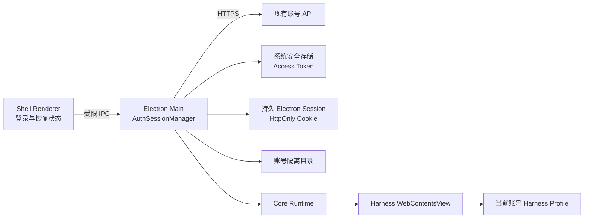

# 因赛AI桌面登录架构设计

> 状态：approved（2026-08-28）
>
> 本文取代 `docs/business-stage-architecture.md` 和 `docs/superpowers/plans/2026-08-27-auth-and-business-entry.md` 中有关系统浏览器登录、OIDC 优先和插件按账号安装的设计。首版接入现有账号 API，不实现注册、忘记密码、企业切换或新的视觉体系。
>
> 登录后的窗口布局、单侧栏、账号入口和统一设置中心由 [登录后单侧栏集成设计](2026-08-28-authenticated-sidebar-integration-design.md) 定义。该设计取代本文早期的最小 Shell 侧栏和双设置方案。

## 目标

首版在不修改 Core Runtime、不依赖或嵌入旧 Web 项目的前提下，为桌面客户端加入验证码登录、密码登录、会话恢复、账号数据隔离、用户入口和退出能力。客户端启动后必须先确认登录状态；未登录、断网或会话失效时不得启动或显示 Harness。

旧项目 `/Users/boxser.shi/Documents/inside/insight-web-platform` 只用于确认现有 API、字段和错误行为。Shell 不复制旧项目代码，不引用其源码或构建产物，也不加载其 Web 页面。

## 首版范围

首版包含：

- 手机号和短信验证码登录；
- 手机号、密码和图形验证码登录；
- 启动时自动恢复和刷新会话；
- 网络失败与会话失效的独立状态；
- 用户头像、昵称、最小设置页和退出入口；
- 用户级 Harness Profile、对话、插件配置和本地产物隔离；
- 设备级插件包共享；
- macOS 和 Windows 的既有 Runtime、Better Sidebar 与打包回归。

首版不包含注册、忘记密码、邀请码、直接账号切换、企业切换、离线进入 Harness、历史 Profile 自动迁移、正式业务首页或新的 Design Tokens。注册与忘记密码作为后续独立切片，不在首版展示未完成入口。

## 方案选择

采用 Electron Main 统一管理认证和会话。Shell Renderer 只负责登录交互和状态展示；Main 调用现有 API、管理 Cookie、加密保存访问令牌并控制 Runtime 生命周期。Renderer、Harness 和插件均不得读取令牌。

未采用以下方案：

- Renderer 直接调用 API：会把令牌、刷新、Cookie 和跨域处理放入页面，扩大凭证暴露面；
- 系统浏览器登录：适合未来 OAuth 或 SSO，但不符合当前复用手机号、验证码和密码接口的范围。

## 组件边界



Shell Renderer 是客户端页面入口。它只接收会话状态和用户摘要，不接收访问令牌、刷新凭证或 Cookie。Main 中的 `AuthSessionManager` 是桌面认证状态的唯一写入者，并负责现有账号 API、凭证持久化、恢复、刷新和退出。

Core Runtime 保持登录和视觉无关。Harness 在认证成功后作为 `WebContentsView` 附着到 Shell，而不是继续占用主窗口的顶层导航。Harness 使用独立 preload；Shell preload 只暴露认证、用户动作和工作区布局所需的窄 IPC。

## API 与环境

首版使用已经确认的接口：

| 能力 | 接口 |
| --- | --- |
| 发送登录验证码 | `/user-server/mobile/getSmsCode` |
| 获取图形验证码 | `/user-server/captcha/captchaImage` |
| 验证码或密码登录 | `/user-server/loginV3` |
| 刷新会话 | `/user-server/refresh` |
| 获取当前用户 | `/user-server/getUserDetail` |
| 退出 | `/user-server/logout` |

未打包运行和 `insightDesktopChannel: development` 的开发包固定使用 `https://gapi-test.insight-aigc.com`。正式包固定使用 `https://gapi.insight-aigc.com`。环境由构建通道决定，不提供用户可编辑开关；认证 Cookie 存储按环境分区，测试与生产不得共享会话。

请求继续携带现有服务所需的 `extinfo: {"client_type":"PC"}`。Main 使用持久 Electron Session 处理 `credentials: include` 和 HttpOnly Cookie，并用 `safeStorage` 加密访问令牌后写入 Shell 拥有的认证状态文件。明文密码、短信验证码和图形验证码只存在于一次登录调用的内存中，不写磁盘或日志。

## 状态机与启动流程

Renderer 可见状态限定为：

```ts
type SessionView =
  | { kind: 'restoring' }
  | { kind: 'unauthenticated' }
  | { kind: 'authenticating'; method: 'sms' | 'password' }
  | { kind: 'authenticated'; account: AccountSummary }
  | { kind: 'offline' }
  | { kind: 'expired' }
```

`AccountSummary` 仅包含界面需要的昵称、头像地址和脱敏手机号。稳定用户 ID 只在 Main 中用于派生账号范围，不暴露给 Renderer；该投影不得包含访问令牌或服务端 Cookie。

启动顺序：

1. 主窗口加载 Shell Renderer，并显示 `restoring`；
2. Main 读取当前环境的加密令牌和持久 Cookie；
3. Main 调用用户信息接口验证会话；
4. 服务端报告会话过期时，Main 最多刷新一次，再重新读取用户信息；
5. 会话有效后，Main 派生账号目录、创建 Runtime 并附着 Harness View；
6. 网络错误进入 `offline`，保留凭证并允许重试，但不启动 Harness；
7. 无凭证或服务端确认失效时进入登录页；
8. 异地登录或运行中失效走与退出相同的本地撤销路径。

网络错误不得被映射为退出或失效。离线状态不清除加密会话；恢复网络后由用户重试或客户端重新验证。首版不凭本地缓存授权离线进入 Harness。

## 登录流程

验证码登录收集手机号、非空短信验证码和协议确认。发送验证码成功后启动 60 秒倒计时，重复点击不得产生并发请求。验证码格式和有效性由服务端判定，客户端只执行输入存在性和长度上限校验。

密码登录收集手机号、密码、图形验证码和协议确认。页面首次进入密码标签时加载验证码；验证失败后刷新验证码。两种登录方式都通过受限 IPC 调用 Main，Main 将输入转发到现有接口。登录成功后立即加密保存令牌、读取用户信息并发布 `authenticated`；失败只返回归一化的字段错误或通用错误，不返回原始响应中的凭证字段。

协议正文不从旧项目复制。首版沿用现有产品协议语义，正式链接由产品发布信息提供并使用系统浏览器打开；链接缺失不得发布正式安装包，但不阻塞本地架构开发。

## 窗口与工作区

主窗口始终加载 Shell 自有 Renderer，但它只负责未登录、恢复、离线和失效界面。认证成功后 Harness `WebContentsView` 覆盖整个窗口内容区，Harness 原生侧栏是唯一可见导航。品牌、账号入口、统一设置入口和 macOS 拖拽区由随客户端发布的第一方插件通过 Core 正式扩展槽提供。

详细所有权、禁止事项、降级策略和 upstream 决策矩阵见 [登录后单侧栏集成设计](2026-08-28-authenticated-sidebar-integration-design.md)。退出、失效或切换到非认证状态时，Main 先隐藏并销毁 View，再停止 Runtime。

## 账号、资产与插件隔离

账号目录使用当前环境和稳定用户 ID 派生的不可逆键；未来出现企业 ID 时可将企业范围加入派生输入，不改变 Renderer 或 Runtime 接口。

```text
<userData>/insight/
  auth/                         # 当前环境的加密认证状态
  plugins/
    packages/                   # 设备级共享的已导入插件包
    registry.json               # 设备级插件目录
  accounts/<account-scope>/
    shell/                      # 当前账号非敏感 Shell 状态
    harness/                    # 对话、Profile、插件配置和状态
    cache/                      # 可清理的账号缓存与本地产物
```

插件代码和版本属于设备：用户导入一次后，所有本机账号都能在插件列表中看到，不重复下载或占用多份安装空间。插件启用状态、配置、密钥、缓存、对话和产物属于账号，不能跨账号复用。共享插件包不得保存业务凭证或账号资产。

Better Sidebar 是出厂插件，每个新账号 Profile 默认启用。用户导入的插件进入设备目录，但在账号 Profile 中建立独立配置。业务资产的最终权限由服务端逐请求判断；目录隔离只能防止本机账号之间误用，不能替代服务端鉴权。

退出不会删除账号目录。Main 尽力调用退出接口，然后无条件清除本地凭证、停止 Runtime、销毁 View 并清空内存用户状态。再次登录同一账号可以重新使用其隔离数据；其他账号无法获得该目录。现有设备级 `insight/harness` 不自动迁移给首个登录账号，避免错误归属。

## 视觉与主题范围

首版不建立 Design Tokens，也不重新定义产品视觉体系。Shell 登录页、用户入口和状态页沿用当前 Harness 的色彩、字体密度、圆角和深浅主题行为，确保双主题可用即可。Core Runtime 不承载样式；第一方插件继续使用各自现有主题实现。

视觉审计、品牌体系、Design Tokens、Harness 主题适配和第一方插件统一作为后续非阻塞工作。当前实现不得通过大面积 CSS 注入或修改 upstream DOM 强行统一风格，以免形成脆弱依赖。登录页样式集中在 Shell Renderer；登录后产品入口样式由第一方集成插件通过正式扩展槽提供。

## 错误处理与安全规则

- Main 依据稳定响应 `code` 区分字段错误、会话失效和业务拒绝，不解析中文 `msg` 推断认证状态；
- 网络失败、超时和服务异常进入可恢复错误，不清除凭证；
- refresh 最多重试一次，同一时刻只允许一个刷新操作，其余请求等待结果；
- 退出接口失败不阻止本地退出；
- Renderer 事件必须来自主窗口主 frame，参数在 IPC 边界校验；
- 日志不得记录密码、验证码、访问令牌、Cookie 或完整手机号；
- Harness 和第三方插件不获得桌面认证 IPC；
- API 环境、认证分区和账号目录必须同时包含测试或生产范围，防止跨环境复用；
- 系统安全存储不可用时不得明文持久化令牌。

## Upstream 与发布边界

新增实现优先放入 `src/main/auth/`、`src/main/workspace/`、`src/renderer/` 和拆分后的 Shell/Harness preload。现有 `src/main/index.ts` 只负责装配和应用生命周期，认证与工作区逻辑不继续堆入该文件。`src/shared/contracts.ts` 和 `electron.vite.config.ts` 只增加必要接口与构建入口。

Core Runtime、Runtime 制品锁定、bundled profile、Better Sidebar 来源和打包脚本不因登录功能改变所有权。后续同步 Shell upstream 时，冲突应集中在主进程装配和窗口接线，业务模块本身保持独立；登录后 UI 的合并边界以 [登录后单侧栏集成设计](2026-08-28-authenticated-sidebar-integration-design.md) 为准。

## 验证策略

自动验证覆盖：

- 会话状态机不向 Renderer 暴露凭证；
- 验证码、图形验证码、登录、刷新、用户信息和退出的响应归一化；
- refresh 单飞、一次重试、网络错误与失效分流；
- 安全存储的写入、恢复和清除；
- 测试与生产认证分区隔离；
- 账号范围派生稳定且不泄露原始用户 ID；
- 插件包设备共享、插件配置和数据账号隔离；
- 未认证和离线状态不能启动 Runtime；
- 登录成功只启动当前账号 Runtime；
- 退出或失效先销毁 View，再停止 Runtime；
- 现有插件恢复、安全模式、目录选择和安全策略不回归。

本地验证遵循现有构建 Runbook 的渐进曲线：聚焦测试、`npm test`、`npm run typecheck`、`npm run build`、开发模式手工验证、目录包、DMG，全部通过后才触发 GitHub Actions。人工验收至少覆盖两种登录方式、重启恢复、断网重试、用户菜单、退出、两个账号的数据隔离，以及 Markdown/HTML 仍由 Better Sidebar 在工作区内打开。

## 后续预留

首版稳定后再分别规划注册与忘记密码、企业范围、直接账号切换、正式业务首页、设备数据清理、OAuth/SSO，以及 Insight Design Tokens 和 Shell/Harness/第一方插件的视觉统一。后续能力不得通过扩大 Renderer 凭证权限或让 Core Runtime 接管身份来实现。
