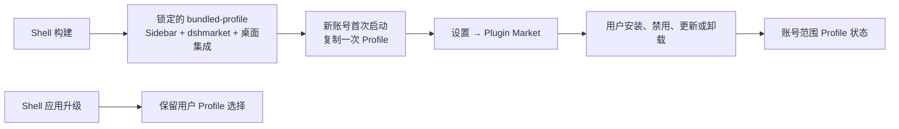

# 出厂插件市场设计

> 状态：approved（2026-09-04）

## 目标

因赛AI Desktop 在首次安装时离线提供 `dshmarket`，让用户通过 Harness 的设置中心发现、安装、启停、更新和卸载社区插件，同时保留现有的本地插件导入入口。市场是可选的出厂插件，不是 Shell、Core Runtime 或业务能力的更新器。

## 决策

采用“构建期锁定并随包提供”方案。Shell 的 `bundled-profile` 固定加入 `dshmarket@1.41.0`；该版本的 peer dependencies 已覆盖锁定 Core Runtime 中的 `@deepseek-ai/dsh-settings@0.1.1-rc.2`、`@deepseek-ai/cordis@4.0.1` 与 `@deepseek-ai/schemastery@3.18.1`。

不采用首次启动在线安装，因为安装是否成功会取决于网络、npm 和 GitHub 可达性；不 Fork `dshmarket`，避免把社区市场的目录、更新和安全维护变成 Shell 的长期职责。

市场包名是 `dshmarket`；`dsh-market` 仅是其 GitHub 仓库名。`dshmarket` 会在 Harness 设置中提供 Plugin Market 页面，现有设置页继续提供本地插件导入及各插件配置入口。

## 插件归属与权限

| 类型 | 包 | 首次安装 | 用户操作 | 更新责任 |
| --- | --- | --- | --- | --- |
| 必需第一方 | `@insight-ai/desktop-integration` | 随包 | 不可卸载、不可独立更新 | Shell 发布 |
| 必需内置能力 | `dsh-better-sidebar@0.16.1` | 随包 | 不可卸载、不可独立更新 | Shell 发布 |
| 出厂可选市场 | `dshmarket@1.41.0` | 随包 | 可卸载、可由用户手动更新 | 用户 |
| 社区或本地插件 | 用户选择的包 | 不自动安装 | 可安装、禁用、更新、卸载 | 用户 |

`dshmarket` 不得获得更新 Shell、`core-runtime.lock.json` 指向的 Runtime、`dsh-better-sidebar` 或 `@insight-ai/desktop-integration` 的能力。市场内发生的网络访问仅限用户主动打开市场后的社区目录读取、插件详情和用户确认的安装/更新操作；首次安装和客户端启动不依赖网络。

## Profile 生命周期

默认 Profile 只在新的 Harness Home 完整复制。用户卸载 `dshmarket` 后，重启或 Shell 升级不得将其自动装回。Shell 继续只修复安装所有权插件的本地副本；不得把这种修复扩大到市场或社区插件。

当前 Profile 的恢复分类将 `dshmarket` 当作核心包，必须在本变更中删除该特殊待遇。这样它既能在设置市场中自我卸载，也能在启动故障恢复或安全模式中作为可移除插件处理。安全模式仍不得允许移除 Sidebar 或桌面集成。

用户导入插件的代码继续按设备共享；插件启用状态、配置、密钥、缓存、会话和业务资产按当前账号隔离。市场的安装、更新和卸载必须沿用这一模型，不得将一个账号的状态复制给另一个账号。

## 兼容性与失败处理

构建期必须通过 DSH CLI 将锁定版本安装到临时 Profile、完成依赖安装，再复制成包内模板。构建失败即停止，不得生成缺少市场依赖的安装包。

运行期市场加载失败时，Harness 应按既有插件恢复流程处理；用户可移除 `dshmarket` 后继续使用客户端。市场不可用不得阻断登录、恢复、设置、退出、Harness 对话或 Sidebar 的 Markdown/HTML 打开能力。

市场提供的社区插件仍是不受 Insight 信任的第三方代码。它们只能使用已有的无敏感客户端消息通道；不得因为市场预装而获得账号令牌、Cookie、账号 ID、目录路径、文件系统或任意 Electron IPC 权限。

## 验证曲线

按低成本到高成本顺序执行，任一步失败均停止后续打包：

1. 针对 Profile 模板、插件分类和卸载命令的单元测试，覆盖市场可卸载、Sidebar/桌面集成不可卸载、卸载后初始化不回装。
2. `npm run typecheck`、相关 Vitest 测试、`npm run build` 与 `npm run prepare:bundled-profile`；检查生成模板的 `package.json`、lockfile 和 `node_modules/dshmarket`。
3. 新 DEV 账号人工验收：设置中出现 Plugin Market，能打开市场；本地导入入口仍可用；Sidebar 可打开 Markdown/HTML。
4. 在 DEV 中卸载市场、重启，确认市场不恢复且登录、设置、退出和 Sidebar 均正常；重新安装或新账号验证预装仍存在。
5. DEV 验收通过后再执行本地目录应用或 DMG；人工确认后才触发 GitHub Actions 的 macOS 与 Windows 构建。

若此变更新增构建、Profile 或市场依赖故障，必须在同一变更中更新 `docs/client-build-runbook.md`；单次故障时间线写入 `docs/incidents/`。

## 与上游的关系

本设计定向采用社区 `dshmarket` 的公开 npm 包，不合并 `dataelement/dsh-desktop` 的市场目录、`package.json`、Lockfile 或发布工作流。Shell 仍以 Core Runtime Release Manifest 作为唯一 Runtime 来源，并保持对上游变更的定向接收策略。
