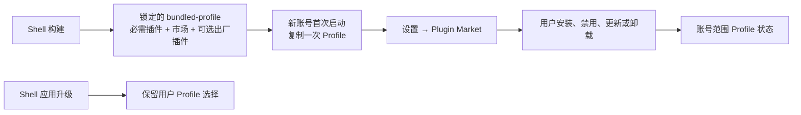

# 出厂插件与插件市场设计

> 状态：approved；市场能力已实施，社区出厂插件扩展待实施（2026-09-07）

## 目标

因赛AI Desktop 在首次安装时提供锁定的插件市场和一组默认启用、允许用户卸载的社区插件。用户继续通过 Harness 设置中的 dsh-market 安装、启停、更新和卸载插件，现有本地插件导入入口保持不变。市场是可选的出厂插件，不是 Shell、Core Runtime、插件生态服务端或业务能力的更新器。

## 决策

采用“构建期锁定并随包提供”方案。Shell 的 `bundled-profile` 固定加入 `dshmarket@1.41.0`；该版本的 peer dependencies 已覆盖锁定 Core Runtime 中的 `@deepseek-ai/dsh-settings@0.1.1-rc.2`、`@deepseek-ai/cordis@4.0.1` 与 `@deepseek-ai/schemastery@3.18.1`。

不采用首次启动在线安装，因为安装是否成功会取决于网络、npm 和 GitHub 可达性；不 Fork `dshmarket`，避免把社区市场的目录、更新和安全维护变成 Shell 的长期职责。

市场包名是 `dshmarket`；`dsh-market` 仅是其 GitHub 仓库名。`dshmarket` 会在 Harness 设置中提供 Plugin Market 页面，现有设置页继续提供本地插件导入及各插件配置入口。本阶段不新增 Shell 插件管理页、设备 registry、管理 CLI 或远端插件策略客户端。

三个新增社区插件使用固定版本制品作为 Shell 构建输入，避免构建时依赖浮动的 Git branch。制品只解决可复现打包，不构成通用插件控制面。未来按客户端版本配置默认插件、服务端推荐、版本治理和跨账号统一状态，由独立插件生态平台设计承接，不进入本轮客户端改造。

## 插件归属与权限

| 类型 | 包 | 首次安装 | 用户操作 | 更新责任 |
| --- | --- | --- | --- | --- |
| 必需第一方 | `@insight-ai/desktop-integration` | 随包 | 不可卸载、不可独立更新 | Shell 发布 |
| 必需内置能力 | `dsh-better-sidebar@0.16.1` | 随包 | 不可卸载、不可独立更新 | Shell 发布 |
| 出厂可选市场 | `dshmarket@1.41.0` | 随包 | 可卸载、可由用户手动更新 | 用户 |
| 出厂可选记忆 | `dsh-memory-evolve@0.1.0`，tag `v26082401` | 随包、默认启用 | 可禁用、更新、卸载 | 用户 |
| 出厂可选生成式 UI | `@changfenhuang/dsh-genui@0.9.8`，tag `v0.9.8` | 随包、默认启用 | 可禁用、更新、卸载 | 用户 |
| 出厂可选提示词增强 | `dsh-prompt-enhance@0.1.9`，tag `v0.1.9` | 随包、默认启用 | 可禁用、更新、卸载 | 用户 |
| 社区或本地插件 | 用户选择的包 | 不自动安装 | 可安装、禁用、更新、卸载 | 用户 |

`dshmarket` 不得获得更新 Shell、`core-runtime.lock.json` 指向的 Runtime、`dsh-better-sidebar` 或 `@insight-ai/desktop-integration` 的能力。市场内发生的网络访问仅限用户主动打开市场后的社区目录读取、插件详情和用户确认的安装/更新操作；首次安装和客户端启动不依赖网络。

`dshmarket@1.41.0` 自带的宿主保护列表不认识因赛AI拥有的 Sidebar 与桌面集成，因此 Shell 在生成 bundled Profile 后对该锁定版本执行一项受测试的宿主策略适配：把两个包加入保护列表，并在 Market 的更新与卸载路由拒绝修改。适配依赖的代码位置不匹配时必须让构建失败，禁止静默产出失去保护的安装包。此适配不 Fork 市场，也不改变普通插件和 Market 自身可卸载、可更新的产品规则；升级 `dshmarket` 时必须重新验证或删除适配。

## Profile 生命周期

默认 Profile 只在新的 Harness Home 完整复制。用户卸载 `dshmarket` 后，重启或 Shell 升级不得将其自动装回。Shell 继续只修复安装所有权插件的本地副本；不得把这种修复扩大到市场或社区插件。

当前 Profile 的恢复分类将 `dshmarket` 当作核心包，必须在本变更中删除该特殊待遇。这样它既能在设置市场中自我卸载，也能在启动故障恢复或安全模式中作为可移除插件处理。安全模式仍不得允许移除 Sidebar 或桌面集成。

当前 dsh-market 和本地导入操作直接修改活跃账号的 DSH Profile，因此安装、禁用、更新和卸载暂时只影响当前账号。新账号首次创建 Profile 时获得全部出厂插件；现有账号保留自己的插件选择。设备级跨账号统一安装和卸载是后续生态平台能力，本轮明确不实现。

插件配置、密钥、缓存、记忆、会话和业务资产继续按当前账号隔离。尤其是 `dsh-memory-evolve`，只有在双账号验收确认记忆和配置没有串用后才可进入安装包。

## 新增插件接纳结论

- `dsh-memory-evolve@0.1.0` 来自固定 tag `v26082401`；仓库声明为 private npm package，因此从该 tag 构建本地制品，不能假设 registry 可安装。
- `@changfenhuang/dsh-genui@0.9.8` 选择稳定 tag `v0.9.8`，不采用 `v0.9.9-preview.1`。
- `dsh-prompt-enhance@0.1.9` 选择固定 tag `v0.1.9`，其声明的最低 DSH 版本覆盖当前 `0.1.1-rc.2`。
- 不预装 `dsh-at-file@0.7.0`。插件维护者已说明新版 Harness 内置同类功能；当前锁定 Core commit `833f4246abaf3ce5fcf39c3f81a8be2499e7f434` 已组合 `@deepseek-ai/dsh-file-reference-local` 和 `@deepseek-ai/dsh-client-ui-reference`，再次安装会形成两套文件引用入口。

## 兼容性与失败处理

构建期必须通过 DSH CLI 将锁定版本逐个安装到临时 Profile、完成依赖安装，再复制成包内模板。新增插件的本地制品与许可证说明保存在 Shell 仓库的受控目录；Profile 中不得留下指向 Downloads、`/private/tmp` 或开发者 clone 目录的绝对路径。构建失败即停止，不得生成缺少任一声明插件的安装包。

任一出厂可选插件加载失败时，Harness 应按既有插件恢复流程处理；用户可移除该插件后继续使用客户端。可选插件不可用不得阻断登录、恢复、设置、退出、Harness 对话或 Sidebar 的 Markdown/HTML 打开能力。

市场提供的社区插件仍是不受 Insight 信任的第三方代码。它们只能使用已有的无敏感客户端消息通道；不得因为市场预装而获得账号令牌、Cookie、账号 ID、目录路径、文件系统或任意 Electron IPC 权限。

## 验证曲线

按低成本到高成本顺序执行，任一步失败均停止后续打包：

1. 三个候选插件分别在 disposable Profile 中完成构建、安装和 Host/Client 加载；一个失败就停止，不进入组合 Profile。
2. 针对 Profile 模板、插件分类和卸载命令的单元测试，覆盖所有新增插件可卸载、Sidebar/桌面集成不可卸载。
3. `npm run typecheck`、相关 Vitest 测试、`npm run build` 与 `npm run prepare:bundled-profile`；检查生成模板的 `package.json`、lockfile 和五个可选插件的物理目录。
4. 新 DEV 账号人工验收：市场和三个新增插件默认启用；Memory Evolve、GenUI、Prompt Enhance 的核心入口可用；Sidebar 仍能打开 Markdown/HTML。
5. DEV 中逐个禁用、卸载、重启，确认当前账号不恢复该插件，其他基本能力正常；再用第二账号确认配置、记忆和会话数据不串用。
6. DEV 验收通过后执行本地目录应用，再执行本地 DMG；人工确认后才触发 GitHub Actions 的 macOS 与 Windows 构建。

若此变更新增构建、Profile 或市场依赖故障，必须在同一变更中更新 `docs/client-build-runbook.md`；单次故障时间线写入 `docs/incidents/`。

## 与上游的关系

本设计定向采用社区插件的固定版本制品，不把它们的 Git 仓库变成 Shell submodule、workspace 或运行时依赖，也不合并其发布工作流。Shell 仍以 Core Runtime Release Manifest 作为唯一 Runtime 来源，并保持对上游变更的定向接收策略。
