# 桌面插件控制面设计

> 状态：approved（2026-09-07）
>
> 本文是 Shell 插件安装范围、出厂插件、用户操作、市场适配和远端策略的当前权威说明。它取代 `docs/superpowers/plans/2026-08-28-device-plugin-sharing.md` 中“插件启用状态默认按账号隔离”的旧设定，并扩展 `docs/plans/2026-09-04-bundled-plugin-market-design.md`。

## 目标

让开发者通过一份清单和一组命令掌握插件从来源、制品、构建期组合、设备安装、账号 Profile 同步、运行期加载、故障恢复到用户卸载的完整链路。插件管理不得依赖手工修改 `node_modules`、账号 Profile 或 dshmarket 代码，也不得让 GitHub 或 npm 成为客户端首次启动的前置条件。

本阶段建立足够小的 Shell 插件控制面，不引入另一套插件运行时。Shell 决定插件策略和生命周期，Core Runtime/DSH 继续负责解析与执行插件，dshmarket 继续负责社区发现和用户操作界面。

## 非目标

- 不替换 DSH/Cordis 插件加载机制。
- 不 Fork dshmarket，也不通过 Electron 注入 CSS 或操作其 DOM 来隐藏界面。
- 不允许服务端在没有用户确认时下载并执行新的插件代码。
- 不在本阶段实现 Core 插件进程隔离、权限沙箱或跨设备插件同步。
- 不把插件配置、密钥、记忆、会话或业务资产写入设备插件目录。

## 决策依据

Chrome Enterprise 的扩展策略已经区分自动安装且不可删除、自动安装但可禁用、允许、阻止和移除等模式；VS Code 的扩展管理同时提供精确版本、本地 VSIX、安装、卸载和清单命令。因赛AI采用这些已经验证的管理语义，但不引入 Chrome 或 VS Code 的扩展运行时，因为它们不能替代 DSH/Cordis 的插件入口、Profile 和加载顺序。

- Chrome 策略参考：<https://support.google.com/chrome/a/answer/9867568?hl=zh-Hans>
- VS Code 扩展管理参考：<https://github.com/microsoft/vscode-docs/blob/main/docs/configure/extensions/extension-marketplace.md>
- VS Code CLI 参考：<https://github.com/microsoft/vscode-docs/blob/main/docs/configure/command-line.md>

## 管理职责

| 组件 | 拥有的事实 | 不拥有的事实 |
| --- | --- | --- |
| Shell | 插件清单、制品锁定、安装模式、设备安装记录、账号同步、用户操作、故障恢复、远端策略 | 插件业务实现和 Cordis 加载语义 |
| Core Runtime/DSH | Profile 解析、依赖安装、Cordis 组合、插件启停和执行 | 插件能否被用户卸载、由谁更新、是否属于出厂插件 |
| dshmarket | 社区目录、详情、安装/更新/卸载入口 | 必需插件保护、设备级安装事实、Shell/Core 更新 |
| 插件 | 入口、bundle patch、客户端注入、依赖和自身配置 | Shell IPC、账号令牌、产品更新、其他插件的生命周期 |

dshmarket 是管理界面之一，不是策略权威。市场动作最后必须收敛到 Shell 的设备安装记录；Shell 启动前再把设备期望状态同步到当前账号 Profile。

## 插件分类

| `installMode` | 对应成熟语义 | 默认状态 | 用户可禁用 | 用户可卸载 | 更新责任 |
| --- | --- | --- | --- | --- | --- |
| `required` | `force_installed` | 所有账号启用 | 否 | 否 | Shell 发布 |
| `bundled-optional` | `normal_installed` | 所有账号启用 | 是，当前账号生效 | 是，整台设备生效 | 用户或 Shell |
| `user` | `allowed` | 导入后所有账号启用 | 是，当前账号生效 | 是，整台设备生效 | 用户 |
| `blocked` | `blocked` / `removed` | 不加载 | 否 | 已安装副本进入隔离 | Shell 安全策略 |

安装模式、来源和权限是三个独立维度。`required` 不表示它天然拥有更多 API；`user` 也不表示它一定来自 npm。

## 设备与账号范围

安装、更新和卸载是设备级事实：

- 用户导入一个插件后，设备 registry 立即记录它，当前账号立即安装，所有其他账号在下次启动前自动安装并默认启用。
- 用户在任意账号卸载一个可卸载插件后，设备 registry 立即删除它并记录出厂插件移除标记；当前账号立即卸载，其他账号在下次启动前清理，不得再次加载。
- 已卸载的 `bundled-optional` 插件不会因重启、切换账号、新建账号或 Shell 升级而自动恢复。用户明确执行“恢复出厂插件”后才清除移除标记。
- 禁用仍是账号级偏好。插件在其他账号保持默认启用；这样满足设备共享安装，又不迫使多个账号共享个人工作偏好。

插件代码与安装事实可以设备共享，数据必须继续隔离：

| 数据 | 范围 |
| --- | --- |
| 插件制品、版本、来源、摘要、安装/移除记录 | 设备 |
| 默认启用规则 | 设备策略 |
| 当前账号禁用覆盖 | 账号 |
| 插件配置、密钥、Cookie、记忆、缓存、会话、产物 | 账号 |

inactive 账号不会运行插件，因此物理清理允许延迟到该账号下次启动前；设备 registry 的逻辑卸载立即生效，任何账号都不能在清理前启动该插件。

## 唯一清单与运行记录

仓库中的 `plugins/desktop-plugins.json` 是出厂策略唯一来源，至少声明：

```json
{
  "schemaVersion": 1,
  "plugins": [
    {
      "packageName": "dshmarket",
      "displayName": "插件市场",
      "version": "1.41.0",
      "installMode": "bundled-optional",
      "defaultEnabled": true,
      "updateOwner": "user",
      "artifact": "artifacts/dshmarket-1.41.0.tgz",
      "sha256": "由受控导入命令生成"
    }
  ]
}
```

摘要不得手工填写占位值。`plugins vendor` 命令在复制制品后计算 SHA-256 并原子更新清单。构建脚本只接受清单中存在、版本一致且摘要匹配的本地 `.tgz`；不接受浮动 branch、未固定的 npm range 或构建期间临时下载的 GitHub 仓库。构建时把制品复制到 Profile 的 `.insight-artifacts/`，Profile 依赖只记录该目录中的相对路径，并随安装包保留这些制品供离线修复；禁止把 Shell checkout 的绝对路径写进 Profile。

安装包内包含一份规范化的 `plugin-manifest.json`，运行时据此识别必需插件和出厂可选插件。设备运行记录位于 `<userData>/insight/plugins/registry.json`；原子写入失败必须保留上一次有效记录。账号 Profile 仍是 DSH 的执行输入，但不再是设备安装事实的唯一来源。

## 开发者操作面

Shell 提供一个入口 `npm run plugins -- <command>`：

```bash
npm run plugins -- inventory
npm run plugins -- vendor-git https://github.com/owner/repo v1.2.3 --mode bundled-optional
npm run plugins -- import-local /absolute/path/to/plugin --mode user
npm run plugins -- import-local /absolute/path/to/plugin.tgz --mode user
npm run plugins -- doctor
npm run plugins -- compose
npm run plugins -- smoke package-name
```

`vendor-git` 只用于开发者制作出厂制品：检出精确 tag、按插件声明运行检查与构建、执行 `npm pack`/`pnpm pack`、复制 `.tgz`、保存来源 commit 和许可证、计算摘要并更新清单。Shell 的日常构建从本地制品开始，不再访问插件仓库。

`import-local` 用于客户端或开发模式的用户导入：目录必须含合法 `package.json`、版本和已经生成的运行入口；`.tgz` 必须能读取 manifest。原始目录先复制或打包到设备 staging，验证通过后 rename 到正式目录，不能把下载目录或临时目录永久写入 Profile。

禁止把 clone 目录直接复制到 Profile 的 `node_modules`。源码可能没有 `lib`、含开发依赖或含未获准的安装脚本；直接复制也不能生成可复现的摘要和许可证记录。

## 构建与运行链路

```mermaid
flowchart LR
  Source[Git tag / npm 精确版本 / 本地目录] --> Vendor[plugins vendor/import]
  Vendor --> Artifact[本地 .tgz + SHA-256 + 来源]
  Artifact --> Manifest[desktop-plugins.json]
  Manifest --> Doctor[doctor: 结构/兼容/冲突/许可证]
  Doctor --> Compose[临时 DSH Profile 组合]
  Compose --> Smoke[Host + Client 启动 smoke]
  Smoke --> Template[bundled-profile]
  Template --> Installer[macOS / Windows 安装包]
  Installer --> Registry[设备 registry]
  Registry --> Reconcile[账号启动前 reconcile]
  Reconcile --> Runtime[Core Runtime 加载]
```



每个阶段都必须可单独运行和检查。`doctor` 不触发打包，`smoke` 不生成 DMG，只有两者通过后才进入客户端目录包和安装包验证。

## 出厂插件清单

### 必需且不可卸载

| 包 | 锁定版本 | 说明 |
| --- | --- | --- |
| `@insight-ai/desktop-integration` | `0.1.0` / workspace artifact | 登录账号菜单、Shell 控制和无敏感数据消息桥 |
| `dsh-better-sidebar` | `0.16.1` | Markdown/HTML 和工作区侧边栏能力 |

### 默认启用且可卸载

| 仓库 | 实际包与候选锁定 | 制品策略 | 接纳要求 |
| --- | --- | --- | --- |
| <https://github.com/dsh-market/dsh-market> | `dshmarket@1.41.0` | 已有 npm 包转本地 `.tgz` | 保持市场可卸载，过滤必需插件 |
| <https://github.com/csyangwen/dsh-memory-evolve> | `dsh-memory-evolve@0.1.0`，tag `v26082401`，commit `21d2a8518bc608c2958b08733f5b5eaf6b514c9c` | 仓库为 `private` npm 包，从固定 tag 构建并 vendor | 双账号记忆/配置隔离、外部命令与远端同步默认行为审计 |
| <https://github.com/omdsh-dev/dsh-genui> | `@changfenhuang/dsh-genui@0.9.8`，tag `v0.9.8` | 固定稳定 tag，忽略 preview tag | 当前 Core 的 fence、slot、React 与浏览器渲染 smoke |
| <https://github.com/rongxingda/dsh-prompt-enhance> | `dsh-prompt-enhance@0.1.9`，tag `v0.1.9` | 固定 tag 或同版本 npm 包转本地 `.tgz` | Core `0.1.1-rc.2` host/client route、设置和 LLM 调用 smoke |

### 当前拒绝进入安装包

用户提出的 <https://github.com/FSMargoo/dsh-at-file> 对应 `dsh-at-file@0.7.0`。其维护者已经明确说明新版 Harness 内置 `@file`/`@session` 引用并建议新安装使用官方实现。Shell 当前锁定的 Core Runtime commit `833f4246abaf3ce5fcf39c3f81a8be2499e7f434` 已组合 `@deepseek-ai/dsh-file-reference-local` 和 `@deepseek-ai/dsh-client-ui-reference`，因此再预装该插件会产生重复输入触发器和两套文件引用行为。

稳定性优先于机械满足插件数量，本版本不把 `dsh-at-file` 放入默认清单。若未来 Core 移除官方能力，或该插件转为官方能力之上的无冲突扩展，必须重新通过能力冲突检查后才能进入 `bundled-optional`。

## 插件接纳门槛

出厂插件属于产品供应链，不等于普通用户自行导入。每个候选必须通过：

1. 精确 tag、commit、包名和 package version 一致；禁止 `main`。
2. 许可证允许分发，并在 `plugins/THIRD_PARTY_NOTICES.md` 保存归属和许可证路径。
3. `main`、`exports`、`dsh.bundle.patch`、客户端入口和声明的注入依赖真实存在。
4. 依赖安装脚本默认拒绝，仅按包名显式 allowlist；当前既有 `node-pty` 例外不能自动扩大到社区插件。
5. 与锁定 Core Runtime 的 peer dependency、Cordis loader id、HTTP route、UI slot、input trigger 和设置 namespace 不冲突。
6. 在 disposable Profile 中执行 Host 启动和浏览器 Client 加载 smoke。
7. macOS arm64 与 Windows x64 至少完成一次安装包内加载验收。
8. 涉及记忆、文件、网络、Shell、外部 Agent 或凭据的插件完成数据范围审计。

当前插件仍在 Harness Runtime 内执行，不具备 VS Code Extension Host 那样的独立进程安全隔离。Shell 的无敏感消息桥只限制插件访问 Electron/账号信息，不能限制插件通过 DSH 服务获得的文件、网络或进程能力。引入出厂社区插件前的代码和行为审计不能被摘要校验替代。

## dshmarket 展示和保护

Shell 的 dshmarket 适配器从清单派生 `required` 包列表，不再硬编码两个正则。对必需插件同时执行：

- 从 Market `/installed` 和 `/updates` 的响应中过滤，避免展示无效的启停、更新、卸载和“本次全部忽略”。
- `update` 和 `uninstall` 路由继续返回 403，防止绕过界面的修改。
- 在 Shell“客户端 → 内置组件”中只读展示版本、摘要和加载健康状态。

市场标题、社区说明、申请收录链接和内部日志布局属于 dshmarket 自身。需要品牌化时优先向插件增加宿主展示配置或提交上游修改；Shell 不做 DOM/CSS 注入。重复日志入口和错误信息在完成必需插件过滤后重新验收，只有剩余问题才进入市场展示适配。

## 故障恢复

- `required` 制品摘要错误或入口缺失时，构建失败；运行期损坏时从安装包模板修复，用户不能卸载。
- `bundled-optional` 或 `user` 插件加载失败时可被安全模式禁用或设备卸载，不得阻断登录和 Agent 基础能力。
- Profile manifest 仍声明插件但 `node_modules` 缺失表示损坏，进入修复；manifest 已删除依赖才表示用户卸载，Shell 据此更新设备 registry。
- 设备 registry 与账号 Profile 同步必须先 staging、验证，再替换。失败保持上一次可启动 Profile，并明确记录包名、版本和阶段。
- 安全模式只加载 Core 与 `required`；设备卸载行为必须留下 tombstone，防止出厂可选插件被模板重新加入。

## 远端策略

真正的“出厂预装”只能由构建清单决定。服务端策略是发布后的管理补充，仅允许：

- `recommend`：展示推荐版本和说明，用户确认后安装；
- `block`：因安全或兼容问题阻止加载已知插件；
- `minimum-version`：提示已安装插件升级；
- `retire`：隐藏推荐并说明替代品。

策略使用独立签名公钥验证、缓存最后一次有效结果、网络失败不阻断启动。服务端不能修改 `required` 版本、不能发送任意脚本、不能静默安装，也不能把远端响应直接传给 DSH CLI。远端策略在本地控制面通过 DEV 和安装包验收后作为独立阶段实施。

## 验证曲线

1. manifest parser、策略分类、摘要校验和冲突规则单元测试。
2. 每个候选插件单独 disposable Profile 安装、Host 启动和 Client smoke；失败插件不得进入组合测试。
3. 全部已接纳插件组合启动，检查 loader id、route、slot、设置和输入触发器冲突。
4. 本地 DEV：新设备状态、双账号默认启用、账号级禁用、设备级卸载和 tombstone。
5. 本地目录应用：登录、会话、设置、Sidebar、Market 和四个插件的核心入口。
6. 本地 DMG 人工验收；通过后才触发 macOS/Windows GitHub Actions。

新增插件导致的构建、签名、Profile、运行时或市场问题必须追加到 `docs/client-build-runbook.md`；具有独立原因链的故障另写 `docs/incidents/`。

## 后续实施边界

第一阶段只落地本地清单、制品、开发者命令、设备 registry、账号同步、市场过滤和三项通过接纳的新增出厂插件。远端策略与服务端接口独立实施。Core 进程隔离和细粒度 DSH capability 权限属于后续安全架构，不阻塞当前业务阶段。
