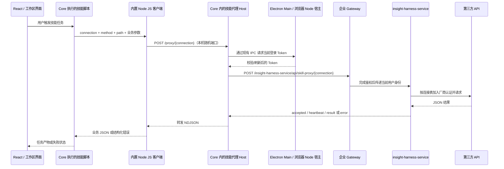

# 技能请求统一转发：FE 开发交接说明

更新日期：2026-09-18

读者：负责 Electron / Node Host / React 的前端开发，以及配合联调的后端开发。

2026-09-18 补充：本地浏览器适配已完成内置 Node 路径注入、第一方插件更新，并挂载 insight-desktop-skills/skills。12 个技能在浏览器候选列表可见，5 个已适配技能的 JS 客户端通过模拟后端链路验证。尚未验收真实厂商调用；正式产品化仍需迁出 Git 忽略目录。

## 1. 交付目标与范围

将技能脚本对外部 API 的调用统一接入企业后端。技能只提交连接标识和业务参数；客户端复用当前登录身份，后端选择第三方地址、补充密钥或签名后调用上游。

开发完成后的体验：用户登录客户端后运行技能，无需在技能中填写用户 Token、厂商 Key、AK/SK，也不需要为代理脚本额外安装系统 Node.js 或 Python。

本文以“技能请求转发”为主，附带现有浏览器运行适配的接入步骤。普通 DeepSeek 对话仍走原模型网关；技能代理是独立请求链路。旧技能的直连请求不会被自动拦截，必须逐个改为调用统一客户端。

### 代码库定位

| 简称 | 代码库 | 职责 |
| --- | --- | --- |
| Shell | `insight-desktop-shell`（本仓库） | Electron/浏览器宿主、登录状态、Host 插件、技能 JS 客户端 |
| Backend | `insight-harness-service`（后端仓库） | 企业鉴权入口、连接配置、第三方认证、请求转发 |

下文文件路径均相对于对应代码库根目录，便于在其他开发机查找。

### 当前完成度

- Shell 已有技能代理 Host、HTTP transport、JS 客户端、shell-env 注入及相应测试源码，可作为正式实现基础。
- Backend 已有 `/api/skill-proxy/{connection_id}`、连接表、NDJSON 返回协议及异步任务句柄处理。
- `.browser-local/` 是此前为本机浏览器验证添加的适配层，被 `.git/info/exclude` 忽略，不会随 Git 克隆分发。
- 浏览器基础登录、工作区、模拟模型对话和账号接管曾完成验证；这些结果不代表技能代理已经在浏览器环境完成真实厂商验收。
- 本文根据当前工作区源码整理。技能代理源码、测试和本文随 `dzm/task/skill-proxy` 分支交付；后端与技能内容仓库需分别取得对应版本。

## 2. 请求链路与职责



关键区别：

- `13082` 是本地浏览器页面和 Core HTTP/WebSocket 的入口。
- 技能代理监听另一个随机本地端口，供 Core 执行的脚本调用。
- React 不直接请求这个私有技能端口。该端口主动拒绝带 `Origin` / `Sec-Fetch-Site` 的浏览器请求。
- 浏览器 Network 看不到 Node/Core 发往 Gateway、以及后端发往厂商的请求。
- 用户 Token 在宿主与 Host 间传递；厂商凭据只存在于 Backend。技能客户端只持有本机代理 capability，即一次启动有效的本地访问凭证。

## 3. 开发入口文件

### Shell

| 文件 | 用途 |
| --- | --- |
| `build/client-service-environment.json` | 当前环境及 authOrigin / modelBaseUrl |
| `src/shared/service-environment.ts` | `skillProxyServiceBaseUrl()` 拼接技能后端地址 |
| `src/main/runtime/harness-runtime.ts` | 桌面 Core 启动、内置 Node 路径注入 |
| `src/main/runtime/model-credential-bridge.ts` | 父子进程凭据桥接 |
| `src/main/auth/auth-session-manager.ts` | 当前账号校验、Token 刷新与退出 |
| `packages/insight-desktop-integration/src/index.ts` | Host 插件注册技能代理和生命周期 |
| `packages/insight-desktop-integration/src/skill-proxy-environment.ts` | 向技能 shell 注入内置 Node 和客户端路径 |
| `packages/insight-desktop-integration/src/skill-proxy.ts` | 本地私有代理、capability 校验、流转发 |
| `packages/insight-desktop-integration/src/skill-proxy-http.ts` | 带当前用户身份访问企业 Gateway |
| `packages/insight-desktop-integration/resources/skill-proxy-client.mjs` | 技能统一调用的 CLI / JS SDK |
| `.browser-local/server.mjs` | 本机浏览器宿主、Core 启动和账号接管 |
| `.browser-local/bridge.js` | 用同源 HTTP 实现原 renderer preload 接口 |

### Backend

| 文件 | 用途 |
| --- | --- |
| `src/insight_harness_service/enterprise_api.py` | 技能代理路由与用户鉴权依赖 |
| `src/insight_harness_service/skill_proxy.py` | 白名单、认证、限流、上游调用和 NDJSON |
| `src/insight_harness_service/skill_connections.json` | connection 到厂商、路径、协议的映射 |
| `src/insight_harness_service/insight_skill_tasks.py` | API Manager 异步任务句柄保护 |
| `config/application-*.json` | 各环境业务配置与凭据，由后端维护 |
| `docs/file-configuration.md` | 最新配置加载与部署说明 |

## 4. 配置方式

### 4.1 Shell 访问哪个企业后端

当前逻辑：

```ts
skillProxyServiceBaseUrl()
// desktopServiceEnvironment().authOrigin + '/insight-harness-service'
```

`build/client-service-environment.json` 的 `releaseEnvironment` 当前为 `production`；仅本地 Dev Harness 子进程通过受控环境变量切换到 `test`。

```text
测试：POST https://gapi-test.insight-aigc.com/insight-harness-service/api/skill-proxy/{connection_id}
生产：POST https://gapi.insight-aigc.com/insight-harness-service/api/skill-proxy/{connection_id}
```

当前没有独立的 `skillProxyBaseUrl` 字段，技能后端跟随 `authOrigin`。改变它也会影响登录服务地址。`modelBaseUrl` 控制普通模型对话，不控制技能代理。

该配置会进入构建产物，变更后需要重新编译插件、准备 Profile，并确认已有账号实际加载的是新插件。若后续要独立配置技能域名，应新增明确的配置字段并保留现有默认值；这是后续开发建议，当前尚未实现。现有客户端 transport 只接受 HTTPS 后端地址。

### 4.2 Backend 访问哪个厂商

连接表 `src/insight_harness_service/skill_connections.json` 控制：

| 字段 | 含义 |
| --- | --- |
| `base_url` | 厂商服务基础地址 |
| `routes` | 允许的精确 path 和 GET/POST 方法 |
| `auth.type` | bearer、api-key 或 insight-auth-v1 |
| `secret_ref` / `access_key_ref` / `secret_key_ref` | 后端配置字段名，不是密钥值 |
| `protocol` | 需要的业务请求转换方式 |
| `timeout_seconds` | 上游等待时间，最大 1200 秒 |

当前连接包括 `tikhub`、`ppt-text`、`media-generator`、`call-insight-api`。两个媒体连接分别对应不同服务，不能互相替换。

**以当前代码为准：后端凭据已改为读取 `config/application-*.json`，不再从 `.env` 或同名业务环境变量读取。**

- `APP_ENV=local/test/prod` 选择对应文件；Shell 的生产环境名为 `production`，后端为 `prod`，名称不同。
- 在选中配置文件中填写 `TIKHUB_API_KEY`、`TX_CLOUD_API_KEY`、`MG_API_AK/SK`、`INSIGHT_API_AK/SK` 等所需字段。
- `SKILL_PROXY_CONFIG_PATH` 现在也是该 JSON 中的字段；留空使用包内连接表，非空时覆盖完整连接表。
- 后端启动时读取 application 配置，修改后需重启；配置随镜像交付时需重建部署。连接表内容在请求时读取。
- FE 不需要获取这些凭据，也不要把真实凭据复制进交接文档、前端配置或技能包。

## 5. FE 开发步骤

### 步骤一：保留现有登录与凭据桥接

复用 `createModelCredentialClient(parentCredentialTransport())`，每次代理请求通过 `credentials.getToken()` 获取当前用户身份。由父进程的原会话管理器完成账号校验及必要的 Token 刷新。

不要新增独立登录体系。不要把用户 Token 放进 React 状态、localStorage、技能参数、命令行、环境变量或连接描述文件。认证失败应返回登录失效，不能使用其他账号的登录状态。

### 步骤二：在 Host 启动私有技能代理

参考 `packages/insight-desktop-integration/src/index.ts`：

1. 等待 `shellEnv` 服务就绪。
2. 取得当前账号的 `DSH_HOME` 和内置 Node 路径。
3. 使用 `startSkillProxy(createSkillProxyRequest(baseUrl, getToken), home)` 启动代理。
4. 只监听 `127.0.0.1` 随机端口。
5. 写入当前账号的 `DSH_HOME/skill-proxy/connection.json`：包含协议版本、端口和本地 capability，不含用户或厂商凭据。
6. 注册释放逻辑：取消等待、关闭端口、清理属于本实例的描述文件。

沿用当前实现的 Host 校验、capability 校验、禁止重定向和请求大小限制。不要为了方便前端调用而开放 CORS。

### 步骤三：发布 JS 客户端并注入执行环境

将 `resources/skill-proxy-client.mjs` 连同插件发布。通过原生 shell-env 提供：

| 变量 | 内容 |
| --- | --- |
| `DSH_HOME` | 当前账号运行目录 |
| `DSH_SKILL_PROXY_NODE` | 内置 Node 可执行文件绝对路径 |
| `DSH_SKILL_PROXY_CLIENT` | 已发布 JS 客户端绝对路径 |

Host 依赖宿主传入的 `INSIGHT_BUNDLED_NODE_PATH`。macOS 的 Electron utility process 中，`process.execPath` 可能是 Electron Helper，不能直接当作技能执行用的 Node。

同时检查新安装与已有账号升级两条路径：实际运行的 Profile 必须包含新版插件代码和 `resources` 文件。只编译源码、不更新账号运行目录，会继续加载旧版本。

### 步骤四：迁移技能调用

将技能原来的 `fetch(厂商 URL)`、curl 或其他直连调用替换为统一 CLI。保留原业务参数构造、结果解析和产物生成。

例如，将业务请求体保存为 `request.json`，在 Core 的技能执行环境中调用：

```bash
"$DSH_SKILL_PROXY_NODE" "$DSH_SKILL_PROXY_CLIENT" \
  tikhub POST /api/v1/douyin/search/fetch_general_search_v2 \
  --body-file request.json
```

`request.json` 示例：

```json
{"keyword":"家居","cursor":0}
```

以上命令是接入示例，会触发实际查询；开发测试使用 mock。也支持 `--query`、`--timeout` 和 `--stdin`。优先用文件或 stdin 传递复杂 JSON，避免 shell 转义错误。通过 Node `spawn` 执行时使用参数数组。

- 成功：进程 exit 0，stdout 为业务 JSON。
- 失败：进程 exit 1，stderr 为结构化错误。
- SDK 自动消费 accepted/heartbeat/result 流；技能通常不需要自行解析 NDJSON。
- 旧 Python 技能若继续保留，仍需自身 Python 环境；本次内置 Node 只解决统一代理客户端的执行依赖。

### 步骤五：处理任务状态与错误

FE/技能侧区分“正在执行”“成功”“明确失败”“结果未知”。

- 心跳仅表示代理仍在等待，不是生成进度百分比。
- 登录失效提示重新登录；重新登录后不得自动重放刚才的收费调用。
- 超时或断开显示“请求结果暂不确定，请先核对任务状态”，不要直接显示厂商已取消。
- 未知连接、路由不在白名单、后端凭据缺失，应明确报错并交给配置维护方处理。
- 禁止失败后回退为厂商直连、内置 Key 或其他登录账号。

### 步骤六：补齐浏览器宿主接入

已有 `.browser-local/` 通过构建原 React 页面、注入 preload 兼容接口、启动本地 Core、代理 HTTP/WebSocket 实现浏览器运行。

以下为浏览器接入步骤；其中 Node 路径注入与第一方插件刷新已于 2026-09-18 在本地适配层完成，可参考 `.browser-local/server.mjs` 和 `.browser-local/profile.mjs`：

1. 本地 `.browser-local/server.mjs` 启动 Core 时，已在 `DSH_HOME` 和 `NO_COLOR` 之外传入实际内置 Node 路径；正式浏览器宿主需要保留这一配置：

   ```js
   env: {
     ...process.env,
     DSH_HOME: home,
     INSIGHT_BUNDLED_NODE_PATH: runtimeNode,
     NO_COLOR: '1'
   }
   ```

2. 本地浏览器适配器在账号 Profile 不存在时复制模板，并在每次启动前刷新第一方 desktop-integration 包，确保已有账号能加载新技能代理。正式浏览器宿主需要保留这套升级逻辑，保留会话、文件和用户插件；不要通过删除整个账号目录完成升级。
3. 继续复用已绑定的父子进程凭据 IPC，React 不接触 Token，也不直接请求私有技能代理端口。
4. 账号退出或被新浏览器接管时，旧 Core 和技能代理一起退出；新进程启动后生成新的连接描述文件。
5. 在真实浏览器工作区触发一次模拟技能调用，验证 shell-env → JS 客户端 → 私有代理 → 模拟后端的完整链路。

上述步骤已在本地适配层补齐并完成技能候选及模拟代理调用验证。正式产品化时需把浏览器能力迁入可维护、可提交的目录和启动脚本，不能依赖被 Git 忽略的 `.browser-local/`；还需按下文清单完成真实服务验收。

## 6. 接口协议

### 本地脚本入口

```text
POST http://127.0.0.1:<随机端口>/proxy/{connection_id}
Authorization: Bearer <本次启动的本地 capability>
```

此接口由统一 SDK 调用，不提供给浏览器 JavaScript。

### 企业后端入口

```text
POST /insight-harness-service/api/skill-proxy/{connection_id}
Content-Type: application/json
Accept: application/x-ndjson
token: <当前用户 Token>
Authorization: Bearer <当前用户 Token>
```

Gateway 后的 Python 路由为 `/api/skill-proxy/{connection_id}`。后端依赖 Gateway 鉴权提供的用户身份，不能让公开调用方自行伪造 userId。

请求体：

```json
{
  "method": "POST",
  "path": "/api/v1/douyin/search/fetch_general_search_v2",
  "query": {},
  "body": {"keyword": "家居", "cursor": 0}
}
```

外层 HTTP 始终 POST；内部 `method` 表示厂商请求的 GET/POST。GET 不允许携带业务 body。调用方不能提交任意 URL、headers、Token 或厂商 Key。

进入转发后的响应为 NDJSON，每行一个 JSON 对象，**不是 SSE**：

```json
{"type":"accepted"}
{"type":"heartbeat"}
{"type":"result","status":200,"body":{"code":200,"data":[]}}
```

传输错误示例：

```json
{"type":"error","status":504,"code":"UPSTREAM_TIMEOUT_OUTCOME_UNKNOWN"}
```

- 流开始前，参数/鉴权/配置问题可返回普通 HTTP 错误。
- 流开始后，外层 HTTP 200 不等于业务成功，必须判断最终 result.status 或 error。
- result.status 成功后，仍按具体厂商约定处理 body 内的业务错误码。
- 心跳间隔 10 秒。上游最长等待 1200 秒，SDK 默认总等待 1250 秒；Gateway/Ingress 需要支持流式响应、禁缓冲并配置相应超时。
- 当前请求上限 2 MiB；后端业务响应上限 8 MiB。SDK 的 9 MiB 接收上限包含协议开销。

### 异步媒体技能

`call-insight-api` 支持 `/v1/proxy_async_create` 和 `/v1/proxy_async_get_result`。创建返回的任务标识经过后端保护并绑定当前用户。技能需保存返回句柄，按现有协议轮询；不要绕过代理使用厂商原始任务 ID。

这是业务 API 的异步能力。通用代理自身不提供持久化任务恢复；创建响应丢失时不能假设重新提交是安全的。

## 7. 开发任务与交付分工

| 交付项 | 主要负责人 | 完成标准 |
| --- | --- | --- |
| Host 启动和登录桥接 | FE / Electron | 每次调用使用当前账号，退出时清理资源 |
| CLI 打包与 shell-env | FE | 无系统 Node 的机器也能执行；中文/空格路径可用 |
| 技能脚本迁移 | FE / 技能维护者 | 指定技能全部走统一 SDK，移除直连凭据依赖 |
| 浏览器接入 | FE | 补齐 Node 路径、旧 Profile 更新和完整技能联调 |
| 界面状态 | FE | 登录失效、结果未知、业务失败可区分；不自动重复提交 |
| 连接表及认证 | BE | 白名单、凭据、签名、业务身份覆盖正确 |
| 网关和部署 | BE / 运维 | 路由鉴权、流式转发、超时和所选环境配置正确 |

建议交付顺序：后端测试接口可用 → Shell mock 测试 → 桌面技能联调 → 浏览器技能联调 → 目标技能逐个迁移 → 测试环境验收 → 打包发布。

## 8. 验证与验收

### 本地检查命令

Shell 根目录：

```bash
npm run typecheck
npm run build:desktop-integration
npm run prepare:bundled-profile
npm test -- --run test/skill-proxy.test.ts test/skill-proxy-http.test.ts test/skill-proxy-client.test.mjs test/skill-proxy-runtime.test.ts
```

Runtime 测试依赖锁定的 Core 已准备好；未准备时可能跳过。必须检查测试输出中的 skipped，不能只看退出码。

Backend 根目录：

```bash
.venv/bin/python -m pytest tests/test_skill_proxy.py -q
```

浏览器适配层已有检查：

```bash
node --test .browser-local/adapter.test.mjs
```

这些 adapter 测试覆盖登录边界和账号接管，不覆盖完整技能代理。第 5 节步骤六的浏览器技能链路已通过本机模拟验证，正式交付仍需补充可复现的端到端验收。

2026-09-18 提交前验证：Shell 两组类型检查通过，技能转发相关 37 项测试、模型凭据及插件/Profile 回归 31 项测试全部通过；插件构建和 bundled-profile 准备成功。以上使用模拟上游，不代表真实厂商接口已验收。

### 必须通过的验收项

- [ ] 桌面/浏览器均能从实际技能进程读取三个必要运行变量，内置 JS 客户端文件存在。
- [ ] 新安装与已有账号升级后均能启动技能代理，不丢失用户会话与文件。
- [ ] mock 上游收到预期 path/method/body；厂商认证仅由后端加入，用户 Token 不外传给厂商。
- [ ] Token 校验/刷新成功后正常请求；登录失效、退出或账号接管后旧技能不能继续取得有效身份。
- [ ] 缺 capability、错误 Host、浏览器 Origin、非法连接、未授权路由均被拒绝。
- [ ] NDJSON 分包、中文跨块、心跳、上游 HTTP 错误、业务错误都正确处理。
- [ ] 请求超时或连接中断不会自动重试，界面明确表示结果未知。
- [ ] 第三方凭据缺失时明确报错，不回退直连。
- [ ] 日志、命令行、环境变量、前端存储、错误信息不泄露用户 Token 或厂商密钥。
- [ ] `call-insight-api` 异步句柄可以恢复轮询，跨用户或伪造句柄被拒绝。
- [ ] 真实测试记录列明环境、目标技能、结果及是否产生费用；模拟成功与真实成功分别记录。

## 9. 常见故障定位

| 现象 | 优先检查 |
| --- | --- |
| `Bundled skill proxy Node runtime is missing` | 宿主是否注入 INSIGHT_BUNDLED_NODE_PATH，路径是否为内置 Node |
| shell 中缺少 DSH_SKILL_PROXY_CLIENT | Host 是否启动成功、shellEnv 是否注册、是否仍加载旧插件 |
| `LOCAL_PROXY_UNAVAILABLE` | 当前 DSH_HOME 下是否存在本次实例的 connection.json，Core 是否已退出 |
| 404 | Gateway 路由/后端版本、连接标识、当前选中的环境 |
| `LOGIN_REQUIRED` | 当前账号会话及 IPC，是否已被其他浏览器登录接管 |
| `SKILL_PROXY_CREDENTIAL_MISSING` | 后端选中 application 文件中的对应字段是否配置 |
| `SKILL_PROXY_ROUTE_FORBIDDEN` | connection 下的精确路径与方法白名单 |
| HTTP 200 但解析失败 | Content-Type 是否被 Gateway 改为 JSON 登录错误；是否错误地按 SSE 解析 |
| 长任务中途断开 | Gateway 缓冲/闲置超时/绝对时限，SDK 是否持续收到心跳 |
| 改完配置仍访问旧地址 | 构建产物、账号 Profile 插件版本及运行进程是否已更新 |

## 10. 交接材料清单

向接手同学提供：本文、Shell 技能代理相关代码提交/补丁、Backend 对应版本、可联调环境地址、待迁移技能清单和测试记录。若要复用浏览器验证方式，另外提供 `.browser-local/` 的必要源码；排除 node_modules、账号 data、测试 storage、日志等本机运行数据。

正式开发按团队规则提交功能源码。本文保存在 `docs/技能请求转发-FE开发交接.md`，随功能分支提交。`.browser-local/` 的本机运行数据、登录状态和依赖不属于交付材料。
